# R_study_Ch04


# Ch04. 데이터 다루기

## 04-1 데이터 수집하기

``` r
# 직접 데이터 입력하기
ID <- c(1, 2, 3, 4, 5)
ID
```

    [1] 1 2 3 4 5

``` r
SEX <- c("F", "M", "F", "M", "F")
SEX
```

    [1] "F" "M" "F" "M" "F"

``` r
DATA <- data.frame(ID = ID, SEX = SEX)
View(DATA)
```

read.table(“데이터 파일”, header = FALSE, skip = 0, nrows = -1, sep =
““, …)

``` r
# txt 파일 가져오기
ex_data <- read.table("../data/data_ex.txt", encoding = "EUC-KR",
                      fileEncoding = 'UTF-8')
View(ex_data)
```

``` r
# 변수명 지정하기
ex_data1 <- read.table("../data/data_ex.txt", encoding = "EUC-KR",
                       fileEncoding = "UTF-8", header = TRUE)
View(ex_data1)
```

``` r
# 변수명으로 사용할 행이 없을 때
varname <- c("ID", "SEX", "AGE", "AREA")
ex1_data <- read.table("../data/data_ex_col.txt", encoding = "EUC-KR",
                       fileEncoding = "UTF-8", col.names = varname)
View(ex1_data)
```

``` r
# 행 스킵하여 가져오기
ex_data2 <- read.table("../data/data_ex.txt", encoding = "EUC-KR",
                       fileEncoding = "UTF-8", header = TRUE, skip = 2)
View(ex_data2)
```

``` r
# 행 개수 지정하여 가져오기
ex_data3 <- read.table("../data/data_ex.txt", encoding = "EUC-KR",
                       fileEncoding = "UTF-8", header= TRUE, nrows = 7)
View(ex_data3)
```

``` r
# 데이터 구분자 지정하여 가져오기
ex_data4 <- read.table("../data/data_ex1.txt", encoding = "EUC-KR",
                       fileEncoding = "UTF-8", header = TRUE, sep = ",")
View(ex_data4)
```

read.csv(“데이터”)

``` r
# csv파일 가져오기
ex_data <- read.csv("../data/data_ex.csv")
View(ex_data)
```

read_excel(“데이터”) : readxl 패키지

``` r
# readxl 패키지 설치 및 로드하기
# install.packages('readxl')
library(readxl)
```

``` r
# 엑셀 파일 가져오기
excel_data_ex <- read_excel("../data/data_ex.xlsx")
View(excel_data_ex)
```

xmlToDataFrame(“데이터”) : XML 패키지

``` r
# XML 패키지 설치 및 로드하기
# install.packages("XML")
library(XML)
```

``` r
# XML 파일 가져오기
xml_data <- xmlToDataFrame("../data/data_ex.xml")
View(xml_data)
```

fromJSON(“데이터”) : jsonlite 패키지, 데이터 프레임으로 가져오지 않음

``` r
# jsonlite 패키지 설치 및 로드하기
# install.packages("jsonlite")
library(jsonlite)
```

``` r
# JSON 파일 가져오기
json_data <- fromJSON("../data/data_ex.json")
str(json_data)
```

    List of 7
     $ 이름    : chr "홍길동"
     $ 나이    : int 25
     $ 성별    : chr "여"
     $ 주소    : chr "서울특별시 양천구 목동"
     $ 특기    : chr [1:2] "농구" "도술"
     $ 가족관계:List of 3
      ..$ #     : int 2
      ..$ 아버지: chr "홍판서"
      ..$ 어머니: chr "춘섬"
     $ 회사    : chr "경기 수원시 팔달구 우만동"

## 04-2 데이터 관측하기

data(): 내장 데이터세트 목록 확인

data(“데이터”) : 내장 데이터 가져오기

``` r
# 내장 데이터 세트 화인
data()
```

``` r
# 내장 데이터 세트 가져오기
data("iris")
```

``` r
# 데이터 세트 확인하기
iris
```

        Sepal.Length Sepal.Width Petal.Length Petal.Width    Species
    1            5.1         3.5          1.4         0.2     setosa
    2            4.9         3.0          1.4         0.2     setosa
    3            4.7         3.2          1.3         0.2     setosa
    4            4.6         3.1          1.5         0.2     setosa
    5            5.0         3.6          1.4         0.2     setosa
    6            5.4         3.9          1.7         0.4     setosa
    7            4.6         3.4          1.4         0.3     setosa
    8            5.0         3.4          1.5         0.2     setosa
    9            4.4         2.9          1.4         0.2     setosa
    10           4.9         3.1          1.5         0.1     setosa
    11           5.4         3.7          1.5         0.2     setosa
    12           4.8         3.4          1.6         0.2     setosa
    13           4.8         3.0          1.4         0.1     setosa
    14           4.3         3.0          1.1         0.1     setosa
    15           5.8         4.0          1.2         0.2     setosa
    16           5.7         4.4          1.5         0.4     setosa
    17           5.4         3.9          1.3         0.4     setosa
    18           5.1         3.5          1.4         0.3     setosa
    19           5.7         3.8          1.7         0.3     setosa
    20           5.1         3.8          1.5         0.3     setosa
    21           5.4         3.4          1.7         0.2     setosa
    22           5.1         3.7          1.5         0.4     setosa
    23           4.6         3.6          1.0         0.2     setosa
    24           5.1         3.3          1.7         0.5     setosa
    25           4.8         3.4          1.9         0.2     setosa
    26           5.0         3.0          1.6         0.2     setosa
    27           5.0         3.4          1.6         0.4     setosa
    28           5.2         3.5          1.5         0.2     setosa
    29           5.2         3.4          1.4         0.2     setosa
    30           4.7         3.2          1.6         0.2     setosa
    31           4.8         3.1          1.6         0.2     setosa
    32           5.4         3.4          1.5         0.4     setosa
    33           5.2         4.1          1.5         0.1     setosa
    34           5.5         4.2          1.4         0.2     setosa
    35           4.9         3.1          1.5         0.2     setosa
    36           5.0         3.2          1.2         0.2     setosa
    37           5.5         3.5          1.3         0.2     setosa
    38           4.9         3.6          1.4         0.1     setosa
    39           4.4         3.0          1.3         0.2     setosa
    40           5.1         3.4          1.5         0.2     setosa
    41           5.0         3.5          1.3         0.3     setosa
    42           4.5         2.3          1.3         0.3     setosa
    43           4.4         3.2          1.3         0.2     setosa
    44           5.0         3.5          1.6         0.6     setosa
    45           5.1         3.8          1.9         0.4     setosa
    46           4.8         3.0          1.4         0.3     setosa
    47           5.1         3.8          1.6         0.2     setosa
    48           4.6         3.2          1.4         0.2     setosa
    49           5.3         3.7          1.5         0.2     setosa
    50           5.0         3.3          1.4         0.2     setosa
    51           7.0         3.2          4.7         1.4 versicolor
    52           6.4         3.2          4.5         1.5 versicolor
    53           6.9         3.1          4.9         1.5 versicolor
    54           5.5         2.3          4.0         1.3 versicolor
    55           6.5         2.8          4.6         1.5 versicolor
    56           5.7         2.8          4.5         1.3 versicolor
    57           6.3         3.3          4.7         1.6 versicolor
    58           4.9         2.4          3.3         1.0 versicolor
    59           6.6         2.9          4.6         1.3 versicolor
    60           5.2         2.7          3.9         1.4 versicolor
    61           5.0         2.0          3.5         1.0 versicolor
    62           5.9         3.0          4.2         1.5 versicolor
    63           6.0         2.2          4.0         1.0 versicolor
    64           6.1         2.9          4.7         1.4 versicolor
    65           5.6         2.9          3.6         1.3 versicolor
    66           6.7         3.1          4.4         1.4 versicolor
    67           5.6         3.0          4.5         1.5 versicolor
    68           5.8         2.7          4.1         1.0 versicolor
    69           6.2         2.2          4.5         1.5 versicolor
    70           5.6         2.5          3.9         1.1 versicolor
    71           5.9         3.2          4.8         1.8 versicolor
    72           6.1         2.8          4.0         1.3 versicolor
    73           6.3         2.5          4.9         1.5 versicolor
    74           6.1         2.8          4.7         1.2 versicolor
    75           6.4         2.9          4.3         1.3 versicolor
    76           6.6         3.0          4.4         1.4 versicolor
    77           6.8         2.8          4.8         1.4 versicolor
    78           6.7         3.0          5.0         1.7 versicolor
    79           6.0         2.9          4.5         1.5 versicolor
    80           5.7         2.6          3.5         1.0 versicolor
    81           5.5         2.4          3.8         1.1 versicolor
    82           5.5         2.4          3.7         1.0 versicolor
    83           5.8         2.7          3.9         1.2 versicolor
    84           6.0         2.7          5.1         1.6 versicolor
    85           5.4         3.0          4.5         1.5 versicolor
    86           6.0         3.4          4.5         1.6 versicolor
    87           6.7         3.1          4.7         1.5 versicolor
    88           6.3         2.3          4.4         1.3 versicolor
    89           5.6         3.0          4.1         1.3 versicolor
    90           5.5         2.5          4.0         1.3 versicolor
    91           5.5         2.6          4.4         1.2 versicolor
    92           6.1         3.0          4.6         1.4 versicolor
    93           5.8         2.6          4.0         1.2 versicolor
    94           5.0         2.3          3.3         1.0 versicolor
    95           5.6         2.7          4.2         1.3 versicolor
    96           5.7         3.0          4.2         1.2 versicolor
    97           5.7         2.9          4.2         1.3 versicolor
    98           6.2         2.9          4.3         1.3 versicolor
    99           5.1         2.5          3.0         1.1 versicolor
    100          5.7         2.8          4.1         1.3 versicolor
    101          6.3         3.3          6.0         2.5  virginica
    102          5.8         2.7          5.1         1.9  virginica
    103          7.1         3.0          5.9         2.1  virginica
    104          6.3         2.9          5.6         1.8  virginica
    105          6.5         3.0          5.8         2.2  virginica
    106          7.6         3.0          6.6         2.1  virginica
    107          4.9         2.5          4.5         1.7  virginica
    108          7.3         2.9          6.3         1.8  virginica
    109          6.7         2.5          5.8         1.8  virginica
    110          7.2         3.6          6.1         2.5  virginica
    111          6.5         3.2          5.1         2.0  virginica
    112          6.4         2.7          5.3         1.9  virginica
    113          6.8         3.0          5.5         2.1  virginica
    114          5.7         2.5          5.0         2.0  virginica
    115          5.8         2.8          5.1         2.4  virginica
    116          6.4         3.2          5.3         2.3  virginica
    117          6.5         3.0          5.5         1.8  virginica
    118          7.7         3.8          6.7         2.2  virginica
    119          7.7         2.6          6.9         2.3  virginica
    120          6.0         2.2          5.0         1.5  virginica
    121          6.9         3.2          5.7         2.3  virginica
    122          5.6         2.8          4.9         2.0  virginica
    123          7.7         2.8          6.7         2.0  virginica
    124          6.3         2.7          4.9         1.8  virginica
    125          6.7         3.3          5.7         2.1  virginica
    126          7.2         3.2          6.0         1.8  virginica
    127          6.2         2.8          4.8         1.8  virginica
    128          6.1         3.0          4.9         1.8  virginica
    129          6.4         2.8          5.6         2.1  virginica
    130          7.2         3.0          5.8         1.6  virginica
    131          7.4         2.8          6.1         1.9  virginica
    132          7.9         3.8          6.4         2.0  virginica
    133          6.4         2.8          5.6         2.2  virginica
    134          6.3         2.8          5.1         1.5  virginica
    135          6.1         2.6          5.6         1.4  virginica
    136          7.7         3.0          6.1         2.3  virginica
    137          6.3         3.4          5.6         2.4  virginica
    138          6.4         3.1          5.5         1.8  virginica
    139          6.0         3.0          4.8         1.8  virginica
    140          6.9         3.1          5.4         2.1  virginica
    141          6.7         3.1          5.6         2.4  virginica
    142          6.9         3.1          5.1         2.3  virginica
    143          5.8         2.7          5.1         1.9  virginica
    144          6.8         3.2          5.9         2.3  virginica
    145          6.7         3.3          5.7         2.5  virginica
    146          6.7         3.0          5.2         2.3  virginica
    147          6.3         2.5          5.0         1.9  virginica
    148          6.5         3.0          5.2         2.0  virginica
    149          6.2         3.4          5.4         2.3  virginica
    150          5.9         3.0          5.1         1.8  virginica

str() : 데이터 구조 확인

ncol(), nrow(), dim() : 데이터 컬럼, 관측치, 컬럼 및 관측치 개수 확인

``` r
# 데이터 구조 확인하기
str(iris)
```

    'data.frame':   150 obs. of  5 variables:
     $ Sepal.Length: num  5.1 4.9 4.7 4.6 5 5.4 4.6 5 4.4 4.9 ...
     $ Sepal.Width : num  3.5 3 3.2 3.1 3.6 3.9 3.4 3.4 2.9 3.1 ...
     $ Petal.Length: num  1.4 1.4 1.3 1.5 1.4 1.7 1.4 1.5 1.4 1.5 ...
     $ Petal.Width : num  0.2 0.2 0.2 0.2 0.2 0.4 0.3 0.2 0.2 0.1 ...
     $ Species     : Factor w/ 3 levels "setosa","versicolor",..: 1 1 1 1 1 1 1 1 1 1 ...

``` r
# 데이터 세트 컬럼 및 관측치 확인하기
ncol(iris)
```

    [1] 5

``` r
nrow(iris)
```

    [1] 150

``` r
dim(iris)
```

    [1] 150   5

``` r
# length() 함수로 데이터 개수 확인
data <- c(1, 2, 3, 4, 5)
length(data)
```

    [1] 5

``` r
length(iris)
```

    [1] 5

``` r
length(iris$Species)
```

    [1] 150

ls() : 데이터 세트 컬럼명 확인

``` r
# 데이터 세트 컬럼명 확인하기
ls(iris)
```

    [1] "Petal.Length" "Petal.Width"  "Sepal.Length" "Sepal.Width"  "Species"     

``` r
# 데이터 앞부분 값 확인하기
head(iris)
```

      Sepal.Length Sepal.Width Petal.Length Petal.Width Species
    1          5.1         3.5          1.4         0.2  setosa
    2          4.9         3.0          1.4         0.2  setosa
    3          4.7         3.2          1.3         0.2  setosa
    4          4.6         3.1          1.5         0.2  setosa
    5          5.0         3.6          1.4         0.2  setosa
    6          5.4         3.9          1.7         0.4  setosa

``` r
# 데이터 뒷부분 값 확인하기
tail(iris, n=3)
```

        Sepal.Length Sepal.Width Petal.Length Petal.Width   Species
    148          6.5         3.0          5.2         2.0 virginica
    149          6.2         3.4          5.4         2.3 virginica
    150          5.9         3.0          5.1         1.8 virginica

``` r
# 평균, 중앙값 구하기
mean(iris$Sepal.Length)
```

    [1] 5.843333

``` r
median(iris$Sepal.Length)
```

    [1] 5.8

``` r
# 최솟값, 최댓값, 범위 구하기
min(iris$Sepal.Length)
```

    [1] 4.3

``` r
max(iris$Sepal.Length)
```

    [1] 7.9

``` r
range(iris$Sepal.Length)
```

    [1] 4.3 7.9

quantile(변수, probs = 0~1) : 분위수, 옵션 지정 안 하면 기본 4분위수
출력

``` r
# 분위수 구하기
quantile(iris$Sepal.Length)
```

      0%  25%  50%  75% 100% 
     4.3  5.1  5.8  6.4  7.9 

``` r
quantile(iris$Sepal.Length, probs = 0.25)
```

    25% 
    5.1 

``` r
quantile(iris$Sepal.Length, probs = 0.5)
```

    50% 
    5.8 

``` r
quantile(iris$Sepal.Length, probs = 0.75)
```

    75% 
    6.4 

``` r
quantile(iris$Sepal.Length, probs = 0.8)
```

     80% 
    6.52 

``` r
# 분산과 표준편차 구하기
var(iris$Sepal.Length)
```

    [1] 0.6856935

``` r
sd(iris$Sepal.Length)
```

    [1] 0.8280661

psych 패키지

-kurtosi() : 첨도

-skew() : 왜도

``` r
# psych 패키지 설치 및 로드하기
# install.packages("psych")
library(psych)
```

``` r
# 첨도와 왜도 구하기
kurtosi(iris$Sepal.Length)
```

    [1] -0.6058125

``` r
skew(iris$Sepal.Length)
```

    [1] 0.3086407

freq(데이터, plot = T) : descr 패키지, 빈도분석, plot = T 기본 막대
그래프 출력

``` r
# descr 패키지 설치 및 로드하기
# install.packages("descr")
library(descr)
```

``` r
# 빈도분석하기
freq_test <- freq(iris$Sepal.Length, plot = F)
freq_test
```

    iris$Sepal.Length 
          Frequency  Percent
    4.3           1   0.6667
    4.4           3   2.0000
    4.5           1   0.6667
    4.6           4   2.6667
    4.7           2   1.3333
    4.8           5   3.3333
    4.9           6   4.0000
    5            10   6.6667
    5.1           9   6.0000
    5.2           4   2.6667
    5.3           1   0.6667
    5.4           6   4.0000
    5.5           7   4.6667
    5.6           6   4.0000
    5.7           8   5.3333
    5.8           7   4.6667
    5.9           3   2.0000
    6             6   4.0000
    6.1           6   4.0000
    6.2           4   2.6667
    6.3           9   6.0000
    6.4           7   4.6667
    6.5           5   3.3333
    6.6           2   1.3333
    6.7           8   5.3333
    6.8           3   2.0000
    6.9           4   2.6667
    7             1   0.6667
    7.1           1   0.6667
    7.2           3   2.0000
    7.3           1   0.6667
    7.4           1   0.6667
    7.6           1   0.6667
    7.7           4   2.6667
    7.9           1   0.6667
    Total       150 100.0000

## 04-3 데이터 탐색하기

막대그래프

-freq(변수, plot = T, main = ‘제목’)

-barplot(변수, ylim=c(), main=‘제목’, xlab=‘x축’, ylab=‘y축’, name=c(),
col=c(),…)

table() : 표로 만들어줌

``` r
# 엑셀 파일 가져오기
library(readxl)
exdata1 <- read_excel("../data/Sample1.xlsx")
exdata1
```

    # A tibble: 20 × 13
          ID SEX     AGE AREA  CAR_YN Y21_AMT Y21_CNT Y21F_AMT Y21O_CNT Y20_AMT
       <dbl> <chr> <dbl> <chr>  <dbl>   <dbl>   <dbl>    <dbl>    <dbl>   <dbl>
     1     1 F        50 서울       1 1300000      50   170000       25 1000000
     2     2 M        40 경기       1  450000      25    50000       10  700000
     3     3 F        28 제주       0  275000      10     7500        3  500000
     4     4 M        50 서울       0 2300000       8    50000        3 2500000
     5     5 M        27 서울       1  845000      30   130000       11  760000
     6     6 F        23 서울       0   42900       1        0        1  300000
     7     7 F        56 경기       0  150000       2     5000        1  130000
     8     8 F        47 서울       1  650000      10    45000        6  400000
     9     9 M        20 서울       0  930000       4    50000        3  250000
    10    10 F        38 경기       0  520000      17    11000       10  550000
    11    11 M        35 서울       0  150000       5    10000        3  490000
    12    12 F        44 제주       1 1150000      53   270000       37 1150000
    13    13 F        60 경기       0  550000      35   120000       10  800000
    14    14 M        55 제주       1 1050000      15   300000        5 2900000
    15    15 F        46 경기       1  600000      16   105000        4 1000000
    16    16 F        32 서울       1  530000      15   380000        7 1000000
    17    17 M        30 경기       1  250000       8    70000        6  400000
    18    18 F        29 서울       1  150000       5     7000        3  100000
    19    19 F        27 제주       0  300000      15   150000       10  320000
    20    20 M        27 제주       1  130000       4    38000        2  150000
    # ℹ 3 more variables: Y20_CNT <dbl>, Y20F_AMT <dbl>, Y20O_CNT <dbl>

``` r
# 막대 그래프 그리기
library(descr)
freq(exdata1$SEX, plot = T, main = '성별(barplot')
```

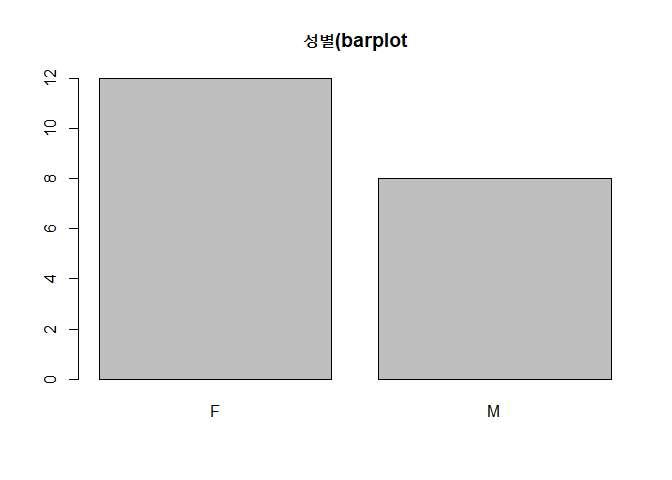

    exdata1$SEX 
          Frequency Percent
    F            12      60
    M             8      40
    Total        20     100

``` r
# 빈도 분포를 구하고 막대 그래프 그리기
dist_sex <- table(exdata1$SEX)
dist_sex
```


     F  M 
    12  8 

``` r
barplot(dist_sex)
```

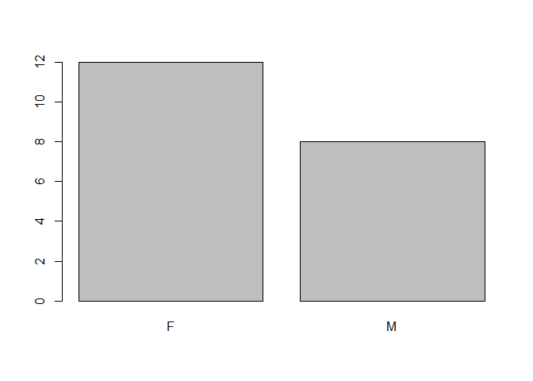

``` r
# 막대 그래프 축 범위와 제목 지정하기
barplot(dist_sex, ylim = c(0, 14), main = "BARPLOT", xlab = "SEX",
        ylab = "FREQUENCY", names = c("Female", "Male"))
```

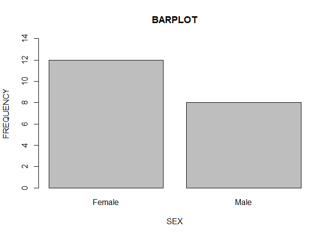

``` r
# 막대 그래프 색상 변경하기
barplot(dist_sex, ylim = c(0, 14), main = "BARPLOT", xlab = "SEX",
        ylab = "FREQUENCY", names = c("Female", "Male"),
        col = c("green", "black"))
```

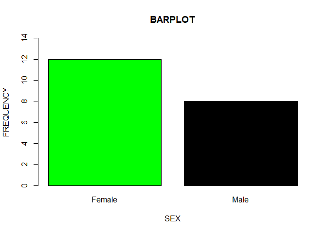

상자 그림: boxplot()

``` r
# 상자 그림 그리기
boxplot(exdata1$Y21_CNT, exdata1$Y20_CNT)
```

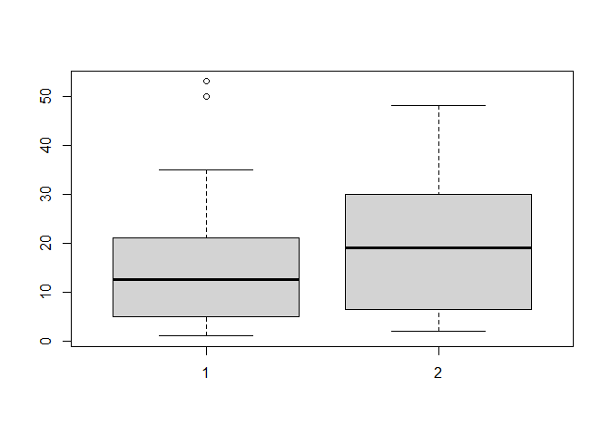

``` r
# 상자 그림 축 범위, 제목 지정하기
boxplot(exdata1$Y21_CNT, exdata1$Y20_CNT, ylim = c(0, 60), main = "boxplot",
        names = c("21년건수", "20년건수"))
```

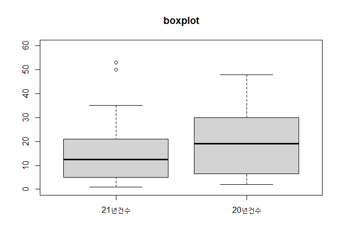

``` r
# 상자 그림 색상 변경하기
boxplot(exdata1$Y21_CNT, exdata1$Y20_CNT, ylim = c(0, 60),
        main = "boxplot", names = c("21년건수", "20년건수"),
        col = c("green", "yellow"))
```

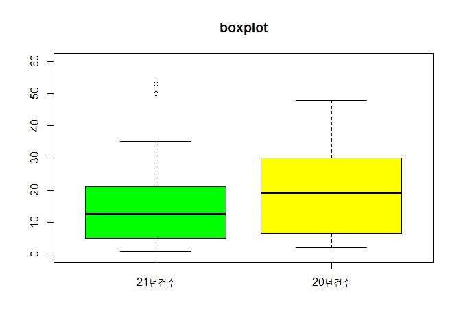

히스토그램: hist()

``` r
# 히스토그램 그리기
hist(exdata1$AGE, xlim = c(0, 60), ylim = c(0, 7), main = "AGE분포")
```

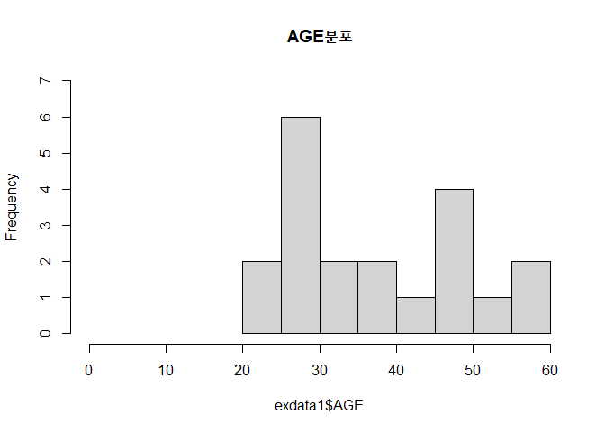

파이차트: pie()

``` r
# 파이차트 그리기
data(mtcars)
x <- table(mtcars$gear)
pie(x)
```

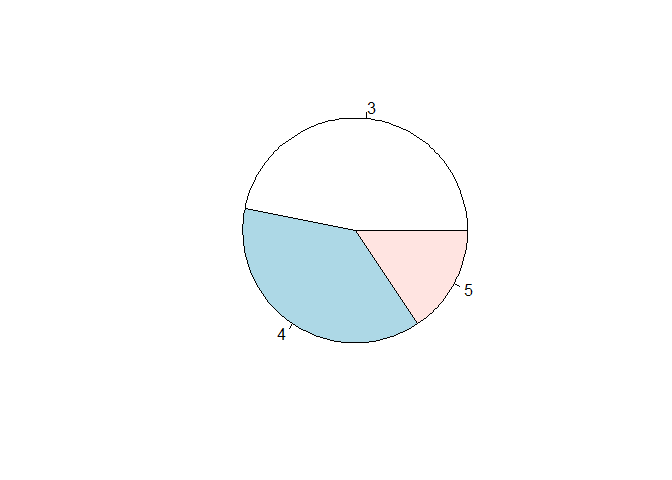

줄기 잎 그림: stem()

``` r
# 줄기 잎 그림 그리기
x <- c(1, 2, 3, 4, 5, 7, 8, 8, 5, 9, 6, 9)
stem(x)
```


      The decimal point is at the |

      0 | 0
      2 | 00
      4 | 000
      6 | 00
      8 | 0000

``` r
# scale 옵션 조정하기
stem(x, scale = 2)
```


      The decimal point is at the |

      1 | 0
      2 | 0
      3 | 0
      4 | 0
      5 | 00
      6 | 0
      7 | 0
      8 | 00
      9 | 00

``` r
stem(x, scale = 0.5)
```


      The decimal point is 1 digit(s) to the right of the |

      0 | 1234
      0 | 55678899

산점도: plot()

산점도 행렬: pairs(), psych패키지의 pairs.panel()

``` r
# 산점도 그리기
data(iris)
plot(x = iris$Sepal.Length, y = iris$Sepal.Width)
```

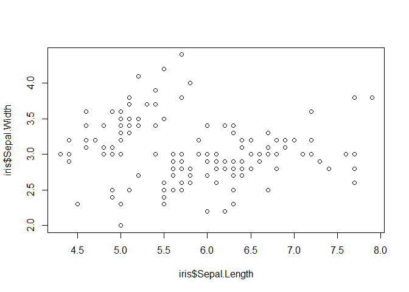

``` r
# 산점도 행렬 그리기
data(iris)
pairs(iris)
```

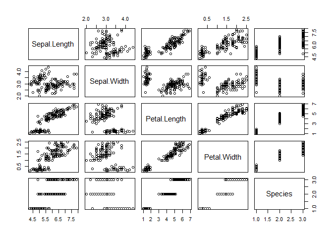

``` r
# psych 패키지로 산점도 행렬 그리기
library(psych)
data(iris)
pairs.panels(iris)
```

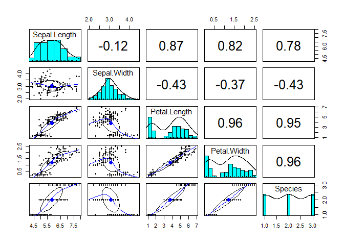
