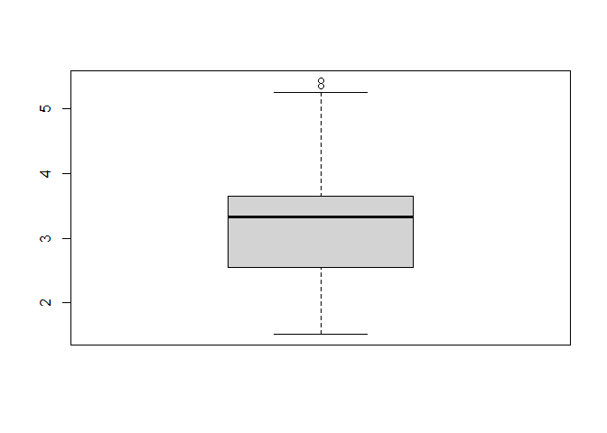

# R_study_Ch05


# Ch05. 데이터 가공하기

## 05-1 dplyr 패키지

``` r
# dplyr 패키지 설치 및 로드하기
# install.packages("dplyr")
library(dplyr)
```


    Attaching package: 'dplyr'

    The following objects are masked from 'package:stats':

        filter, lag

    The following objects are masked from 'package:base':

        intersect, setdiff, setequal, union

\*다른 패키지에 동일한 함수가 있을 경우 ::를 사용해 구분 (dplyr::filter)

행 추출: filter()

열 추출: select()

정렬: arrange(), 내림차순은 desc() 추가

``` r
# 조건에 맞는 데이터 추출하기
filter(mtcars, cyl == 4)
```

                    mpg cyl  disp  hp drat    wt  qsec vs am gear carb
    Datsun 710     22.8   4 108.0  93 3.85 2.320 18.61  1  1    4    1
    Merc 240D      24.4   4 146.7  62 3.69 3.190 20.00  1  0    4    2
    Merc 230       22.8   4 140.8  95 3.92 3.150 22.90  1  0    4    2
    Fiat 128       32.4   4  78.7  66 4.08 2.200 19.47  1  1    4    1
    Honda Civic    30.4   4  75.7  52 4.93 1.615 18.52  1  1    4    2
    Toyota Corolla 33.9   4  71.1  65 4.22 1.835 19.90  1  1    4    1
    Toyota Corona  21.5   4 120.1  97 3.70 2.465 20.01  1  0    3    1
    Fiat X1-9      27.3   4  79.0  66 4.08 1.935 18.90  1  1    4    1
    Porsche 914-2  26.0   4 120.3  91 4.43 2.140 16.70  0  1    5    2
    Lotus Europa   30.4   4  95.1 113 3.77 1.513 16.90  1  1    5    2
    Volvo 142E     21.4   4 121.0 109 4.11 2.780 18.60  1  1    4    2

``` r
# 두 가지 조건에 맞는 데이터를 필터링 하기
filter(mtcars, cyl >= 6 & mpg > 20)
```

                    mpg cyl disp  hp drat    wt  qsec vs am gear carb
    Mazda RX4      21.0   6  160 110 3.90 2.620 16.46  0  1    4    4
    Mazda RX4 Wag  21.0   6  160 110 3.90 2.875 17.02  0  1    4    4
    Hornet 4 Drive 21.4   6  258 110 3.08 3.215 19.44  1  0    3    1

``` r
# 지정한 변수만 추출하기
head(select(mtcars, am, gear))
```

                      am gear
    Mazda RX4          1    4
    Mazda RX4 Wag      1    4
    Datsun 710         1    4
    Hornet 4 Drive     0    3
    Hornet Sportabout  0    3
    Valiant            0    3

``` r
# 오름차순 정렬하기
head(arrange(mtcars, wt))
```

                    mpg cyl  disp  hp drat    wt  qsec vs am gear carb
    Lotus Europa   30.4   4  95.1 113 3.77 1.513 16.90  1  1    5    2
    Honda Civic    30.4   4  75.7  52 4.93 1.615 18.52  1  1    4    2
    Toyota Corolla 33.9   4  71.1  65 4.22 1.835 19.90  1  1    4    1
    Fiat X1-9      27.3   4  79.0  66 4.08 1.935 18.90  1  1    4    1
    Porsche 914-2  26.0   4 120.3  91 4.43 2.140 16.70  0  1    5    2
    Fiat 128       32.4   4  78.7  66 4.08 2.200 19.47  1  1    4    1

``` r
# 오름차순 정렬한 후 내림차순 정렬하기
head(arrange(mtcars, mpg, desc(wt)))
```

                         mpg cyl disp  hp drat    wt  qsec vs am gear carb
    Lincoln Continental 10.4   8  460 215 3.00 5.424 17.82  0  0    3    4
    Cadillac Fleetwood  10.4   8  472 205 2.93 5.250 17.98  0  0    3    4
    Camaro Z28          13.3   8  350 245 3.73 3.840 15.41  0  0    3    4
    Duster 360          14.3   8  360 245 3.21 3.570 15.84  0  0    3    4
    Chrysler Imperial   14.7   8  440 230 3.23 5.345 17.42  0  0    3    4
    Maserati Bora       15.0   8  301 335 3.54 3.570 14.60  0  1    5    8

열 추가: mutate()

중복 값 제거: distinct(), 여러 컬럼 지정 시 모든 열의 값이 동일할 때만
제거

데이터 순위 확인: rank()

``` r
# 새로운 열 추가하기
head(mutate(mtcars, years = "1974"))
```

                       mpg cyl disp  hp drat    wt  qsec vs am gear carb years
    Mazda RX4         21.0   6  160 110 3.90 2.620 16.46  0  1    4    4  1974
    Mazda RX4 Wag     21.0   6  160 110 3.90 2.875 17.02  0  1    4    4  1974
    Datsun 710        22.8   4  108  93 3.85 2.320 18.61  1  1    4    1  1974
    Hornet 4 Drive    21.4   6  258 110 3.08 3.215 19.44  1  0    3    1  1974
    Hornet Sportabout 18.7   8  360 175 3.15 3.440 17.02  0  0    3    2  1974
    Valiant           18.1   6  225 105 2.76 3.460 20.22  1  0    3    1  1974

``` r
head(mutate(mtcars, mpg_rank = rank(mpg)))
```

                       mpg cyl disp  hp drat    wt  qsec vs am gear carb mpg_rank
    Mazda RX4         21.0   6  160 110 3.90 2.620 16.46  0  1    4    4     19.5
    Mazda RX4 Wag     21.0   6  160 110 3.90 2.875 17.02  0  1    4    4     19.5
    Datsun 710        22.8   4  108  93 3.85 2.320 18.61  1  1    4    1     24.5
    Hornet 4 Drive    21.4   6  258 110 3.08 3.215 19.44  1  0    3    1     21.5
    Hornet Sportabout 18.7   8  360 175 3.15 3.440 17.02  0  0    3    2     15.0
    Valiant           18.1   6  225 105 2.76 3.460 20.22  1  0    3    1     14.0

``` r
# 중복 값 제거하기
distinct(mtcars, cyl)
```

                      cyl
    Mazda RX4           6
    Datsun 710          4
    Hornet Sportabout   8

``` r
distinct(mtcars, gear)
```

                   gear
    Mazda RX4         4
    Hornet 4 Drive    3
    Porsche 914-2     5

``` r
# 여러 개 열에서 중복 값 제거하기
distinct(mtcars, cyl, gear)
```

                      cyl gear
    Mazda RX4           6    4
    Datsun 710          4    4
    Hornet 4 Drive      6    3
    Hornet Sportabout   8    3
    Toyota Corona       4    3
    Porsche 914-2       4    5
    Ford Pantera L      8    5
    Ferrari Dino        6    5

데이터 요약: summarise(), summarize()

그룹화: group_by()

n() : 데이터 개수

n_distinct() : 중복 값 제외 개수

n()과 n_distinct()는 단독 사용 불가하며 summarise(), mutate(), filter()
함수에서만 사용 가능

``` r
# 데이터 요약하기
summarise(mtcars, cyl_mean = mean(cyl), cyl_min = min(cyl), cyl_max = max(cyl))
```

      cyl_mean cyl_min cyl_max
    1   6.1875       4       8

``` r
summarise(mtcars, mean(cyl), min(cyl), max(cyl))
```

      mean(cyl) min(cyl) max(cyl)
    1    6.1875        4        8

``` r
# 그룹별로 요약하기
gr_cyl <- group_by(mtcars, cyl)
summarise(gr_cyl, n())
```

    # A tibble: 3 × 2
        cyl `n()`
      <dbl> <int>
    1     4    11
    2     6     7
    3     8    14

``` r
gr_cyl <- group_by(mtcars, cyl)
summarise(gr_cyl, n_distinct(gear))
```

    # A tibble: 3 × 2
        cyl `n_distinct(gear)`
      <dbl>              <int>
    1     4                  3
    2     6                  3
    3     8                  2

샘플 추출

-sample_n() : 개수 기준 추출

-sample_frac() : 비율 기준 추출

``` r
# 샘플 데이터 10개 추출하기
sample_n(mtcars, 10)
```

                    mpg cyl  disp  hp drat    wt qsec vs am gear carb
    Merc 450SLC    15.2   8 275.8 180 3.07 3.780 18.0  0  0    3    3
    Merc 280C      17.8   6 167.6 123 3.92 3.440 18.9  1  0    4    4
    Ferrari Dino   19.7   6 145.0 175 3.62 2.770 15.5  0  1    5    6
    Merc 230       22.8   4 140.8  95 3.92 3.150 22.9  1  0    4    2
    Porsche 914-2  26.0   4 120.3  91 4.43 2.140 16.7  0  1    5    2
    Maserati Bora  15.0   8 301.0 335 3.54 3.570 14.6  0  1    5    8
    Fiat X1-9      27.3   4  79.0  66 4.08 1.935 18.9  1  1    4    1
    Merc 240D      24.4   4 146.7  62 3.69 3.190 20.0  1  0    4    2
    Lotus Europa   30.4   4  95.1 113 3.77 1.513 16.9  1  1    5    2
    Ford Pantera L 15.8   8 351.0 264 4.22 3.170 14.5  0  1    5    4

``` r
# 전체 데이터의 20%를 샘플로 추출하기
sample_frac(mtcars, 0.2)
```

                        mpg cyl  disp  hp drat    wt  qsec vs am gear carb
    Fiat 128           32.4   4  78.7  66 4.08 2.200 19.47  1  1    4    1
    Cadillac Fleetwood 10.4   8 472.0 205 2.93 5.250 17.98  0  0    3    4
    Merc 450SLC        15.2   8 275.8 180 3.07 3.780 18.00  0  0    3    3
    Ford Pantera L     15.8   8 351.0 264 4.22 3.170 14.50  0  1    5    4
    Merc 280C          17.8   6 167.6 123 3.92 3.440 18.90  1  0    4    4
    Lotus Europa       30.4   4  95.1 113 3.77 1.513 16.90  1  1    5    2

파이프 연산자 %\>% : 함수 연달아 사용 가능

``` r
# 파이프 연산자로 그룹별 요약하기
group_by(mtcars, cyl) %>% summarise(n())
```

    # A tibble: 3 × 2
        cyl `n()`
      <dbl> <int>
    1     4    11
    2     6     7
    3     8    14

``` r
# 파이프 연산자 없이 순위 기준으로 정렬하기
mp_rank <- mutate(mtcars, mpg_rank = rank(mpg))
arrange(mp_rank, mpg_rank)
```

                         mpg cyl  disp  hp drat    wt  qsec vs am gear carb
    Cadillac Fleetwood  10.4   8 472.0 205 2.93 5.250 17.98  0  0    3    4
    Lincoln Continental 10.4   8 460.0 215 3.00 5.424 17.82  0  0    3    4
    Camaro Z28          13.3   8 350.0 245 3.73 3.840 15.41  0  0    3    4
    Duster 360          14.3   8 360.0 245 3.21 3.570 15.84  0  0    3    4
    Chrysler Imperial   14.7   8 440.0 230 3.23 5.345 17.42  0  0    3    4
    Maserati Bora       15.0   8 301.0 335 3.54 3.570 14.60  0  1    5    8
    Merc 450SLC         15.2   8 275.8 180 3.07 3.780 18.00  0  0    3    3
    AMC Javelin         15.2   8 304.0 150 3.15 3.435 17.30  0  0    3    2
    Dodge Challenger    15.5   8 318.0 150 2.76 3.520 16.87  0  0    3    2
    Ford Pantera L      15.8   8 351.0 264 4.22 3.170 14.50  0  1    5    4
    Merc 450SE          16.4   8 275.8 180 3.07 4.070 17.40  0  0    3    3
    Merc 450SL          17.3   8 275.8 180 3.07 3.730 17.60  0  0    3    3
    Merc 280C           17.8   6 167.6 123 3.92 3.440 18.90  1  0    4    4
    Valiant             18.1   6 225.0 105 2.76 3.460 20.22  1  0    3    1
    Hornet Sportabout   18.7   8 360.0 175 3.15 3.440 17.02  0  0    3    2
    Merc 280            19.2   6 167.6 123 3.92 3.440 18.30  1  0    4    4
    Pontiac Firebird    19.2   8 400.0 175 3.08 3.845 17.05  0  0    3    2
    Ferrari Dino        19.7   6 145.0 175 3.62 2.770 15.50  0  1    5    6
    Mazda RX4           21.0   6 160.0 110 3.90 2.620 16.46  0  1    4    4
    Mazda RX4 Wag       21.0   6 160.0 110 3.90 2.875 17.02  0  1    4    4
    Hornet 4 Drive      21.4   6 258.0 110 3.08 3.215 19.44  1  0    3    1
    Volvo 142E          21.4   4 121.0 109 4.11 2.780 18.60  1  1    4    2
    Toyota Corona       21.5   4 120.1  97 3.70 2.465 20.01  1  0    3    1
    Datsun 710          22.8   4 108.0  93 3.85 2.320 18.61  1  1    4    1
    Merc 230            22.8   4 140.8  95 3.92 3.150 22.90  1  0    4    2
    Merc 240D           24.4   4 146.7  62 3.69 3.190 20.00  1  0    4    2
    Porsche 914-2       26.0   4 120.3  91 4.43 2.140 16.70  0  1    5    2
    Fiat X1-9           27.3   4  79.0  66 4.08 1.935 18.90  1  1    4    1
    Honda Civic         30.4   4  75.7  52 4.93 1.615 18.52  1  1    4    2
    Lotus Europa        30.4   4  95.1 113 3.77 1.513 16.90  1  1    5    2
    Fiat 128            32.4   4  78.7  66 4.08 2.200 19.47  1  1    4    1
    Toyota Corolla      33.9   4  71.1  65 4.22 1.835 19.90  1  1    4    1
                        mpg_rank
    Cadillac Fleetwood       1.5
    Lincoln Continental      1.5
    Camaro Z28               3.0
    Duster 360               4.0
    Chrysler Imperial        5.0
    Maserati Bora            6.0
    Merc 450SLC              7.5
    AMC Javelin              7.5
    Dodge Challenger         9.0
    Ford Pantera L          10.0
    Merc 450SE              11.0
    Merc 450SL              12.0
    Merc 280C               13.0
    Valiant                 14.0
    Hornet Sportabout       15.0
    Merc 280                16.5
    Pontiac Firebird        16.5
    Ferrari Dino            18.0
    Mazda RX4               19.5
    Mazda RX4 Wag           19.5
    Hornet 4 Drive          21.5
    Volvo 142E              21.5
    Toyota Corona           23.0
    Datsun 710              24.5
    Merc 230                24.5
    Merc 240D               26.0
    Porsche 914-2           27.0
    Fiat X1-9               28.0
    Honda Civic             29.5
    Lotus Europa            29.5
    Fiat 128                31.0
    Toyota Corolla          32.0

``` r
# 파이프 연산자를 사용하여 순위 기준으로 정렬하기
mutate(mtcars, mpg_rank = rank(mpg)) %>% arrange(mpg_rank)
```

                         mpg cyl  disp  hp drat    wt  qsec vs am gear carb
    Cadillac Fleetwood  10.4   8 472.0 205 2.93 5.250 17.98  0  0    3    4
    Lincoln Continental 10.4   8 460.0 215 3.00 5.424 17.82  0  0    3    4
    Camaro Z28          13.3   8 350.0 245 3.73 3.840 15.41  0  0    3    4
    Duster 360          14.3   8 360.0 245 3.21 3.570 15.84  0  0    3    4
    Chrysler Imperial   14.7   8 440.0 230 3.23 5.345 17.42  0  0    3    4
    Maserati Bora       15.0   8 301.0 335 3.54 3.570 14.60  0  1    5    8
    Merc 450SLC         15.2   8 275.8 180 3.07 3.780 18.00  0  0    3    3
    AMC Javelin         15.2   8 304.0 150 3.15 3.435 17.30  0  0    3    2
    Dodge Challenger    15.5   8 318.0 150 2.76 3.520 16.87  0  0    3    2
    Ford Pantera L      15.8   8 351.0 264 4.22 3.170 14.50  0  1    5    4
    Merc 450SE          16.4   8 275.8 180 3.07 4.070 17.40  0  0    3    3
    Merc 450SL          17.3   8 275.8 180 3.07 3.730 17.60  0  0    3    3
    Merc 280C           17.8   6 167.6 123 3.92 3.440 18.90  1  0    4    4
    Valiant             18.1   6 225.0 105 2.76 3.460 20.22  1  0    3    1
    Hornet Sportabout   18.7   8 360.0 175 3.15 3.440 17.02  0  0    3    2
    Merc 280            19.2   6 167.6 123 3.92 3.440 18.30  1  0    4    4
    Pontiac Firebird    19.2   8 400.0 175 3.08 3.845 17.05  0  0    3    2
    Ferrari Dino        19.7   6 145.0 175 3.62 2.770 15.50  0  1    5    6
    Mazda RX4           21.0   6 160.0 110 3.90 2.620 16.46  0  1    4    4
    Mazda RX4 Wag       21.0   6 160.0 110 3.90 2.875 17.02  0  1    4    4
    Hornet 4 Drive      21.4   6 258.0 110 3.08 3.215 19.44  1  0    3    1
    Volvo 142E          21.4   4 121.0 109 4.11 2.780 18.60  1  1    4    2
    Toyota Corona       21.5   4 120.1  97 3.70 2.465 20.01  1  0    3    1
    Datsun 710          22.8   4 108.0  93 3.85 2.320 18.61  1  1    4    1
    Merc 230            22.8   4 140.8  95 3.92 3.150 22.90  1  0    4    2
    Merc 240D           24.4   4 146.7  62 3.69 3.190 20.00  1  0    4    2
    Porsche 914-2       26.0   4 120.3  91 4.43 2.140 16.70  0  1    5    2
    Fiat X1-9           27.3   4  79.0  66 4.08 1.935 18.90  1  1    4    1
    Honda Civic         30.4   4  75.7  52 4.93 1.615 18.52  1  1    4    2
    Lotus Europa        30.4   4  95.1 113 3.77 1.513 16.90  1  1    5    2
    Fiat 128            32.4   4  78.7  66 4.08 2.200 19.47  1  1    4    1
    Toyota Corolla      33.9   4  71.1  65 4.22 1.835 19.90  1  1    4    1
                        mpg_rank
    Cadillac Fleetwood       1.5
    Lincoln Continental      1.5
    Camaro Z28               3.0
    Duster 360               4.0
    Chrysler Imperial        5.0
    Maserati Bora            6.0
    Merc 450SLC              7.5
    AMC Javelin              7.5
    Dodge Challenger         9.0
    Ford Pantera L          10.0
    Merc 450SE              11.0
    Merc 450SL              12.0
    Merc 280C               13.0
    Valiant                 14.0
    Hornet Sportabout       15.0
    Merc 280                16.5
    Pontiac Firebird        16.5
    Ferrari Dino            18.0
    Mazda RX4               19.5
    Mazda RX4 Wag           19.5
    Hornet 4 Drive          21.5
    Volvo 142E              21.5
    Toyota Corona           23.0
    Datsun 710              24.5
    Merc 230                24.5
    Merc 240D               26.0
    Porsche 914-2           27.0
    Fiat X1-9               28.0
    Honda Civic             29.5
    Lotus Europa            29.5
    Fiat 128                31.0
    Toyota Corolla          32.0

## 05-2 데이터 가공하기

``` r
# 패키지 로드 및 데이터 불러오기
library(dplyr)
library(readxl)
exdata1 <- read_excel("../data/Sample1.xlsx")
exdata1
```

    # A tibble: 20 × 13
          ID SEX     AGE AREA  CAR_YN Y21_AMT Y21_CNT Y21F_AMT Y21O_CNT Y20_AMT
       <dbl> <chr> <dbl> <chr>  <dbl>   <dbl>   <dbl>    <dbl>    <dbl>   <dbl>
     1     1 F        50 서울       1 1300000      50   170000       25 1000000
     2     2 M        40 경기       1  450000      25    50000       10  700000
     3     3 F        28 제주       0  275000      10     7500        3  500000
     4     4 M        50 서울       0 2300000       8    50000        3 2500000
     5     5 M        27 서울       1  845000      30   130000       11  760000
     6     6 F        23 서울       0   42900       1        0        1  300000
     7     7 F        56 경기       0  150000       2     5000        1  130000
     8     8 F        47 서울       1  650000      10    45000        6  400000
     9     9 M        20 서울       0  930000       4    50000        3  250000
    10    10 F        38 경기       0  520000      17    11000       10  550000
    11    11 M        35 서울       0  150000       5    10000        3  490000
    12    12 F        44 제주       1 1150000      53   270000       37 1150000
    13    13 F        60 경기       0  550000      35   120000       10  800000
    14    14 M        55 제주       1 1050000      15   300000        5 2900000
    15    15 F        46 경기       1  600000      16   105000        4 1000000
    16    16 F        32 서울       1  530000      15   380000        7 1000000
    17    17 M        30 경기       1  250000       8    70000        6  400000
    18    18 F        29 서울       1  150000       5     7000        3  100000
    19    19 F        27 제주       0  300000      15   150000       10  320000
    20    20 M        27 제주       1  130000       4    38000        2  150000
    # ℹ 3 more variables: Y20_CNT <dbl>, Y20F_AMT <dbl>, Y20O_CNT <dbl>

``` r
# 선택한 변수 추출하기
exdata1 %>% select(ID)
```

    # A tibble: 20 × 1
          ID
       <dbl>
     1     1
     2     2
     3     3
     4     4
     5     5
     6     6
     7     7
     8     8
     9     9
    10    10
    11    11
    12    12
    13    13
    14    14
    15    15
    16    16
    17    17
    18    18
    19    19
    20    20

``` r
# 선택한 변수 여러 개 추출하기
exdata1 %>% select(ID, AREA, Y21_CNT)
```

    # A tibble: 20 × 3
          ID AREA  Y21_CNT
       <dbl> <chr>   <dbl>
     1     1 서울       50
     2     2 경기       25
     3     3 제주       10
     4     4 서울        8
     5     5 서울       30
     6     6 서울        1
     7     7 경기        2
     8     8 서울       10
     9     9 서울        4
    10    10 경기       17
    11    11 서울        5
    12    12 제주       53
    13    13 경기       35
    14    14 제주       15
    15    15 경기       16
    16    16 서울       15
    17    17 경기        8
    18    18 서울        5
    19    19 제주       15
    20    20 제주        4

``` r
# 선택한 변수 제외하고 추출하기
exdata1 %>% select(-AREA)
```

    # A tibble: 20 × 12
          ID SEX     AGE CAR_YN Y21_AMT Y21_CNT Y21F_AMT Y21O_CNT Y20_AMT Y20_CNT
       <dbl> <chr> <dbl>  <dbl>   <dbl>   <dbl>    <dbl>    <dbl>   <dbl>   <dbl>
     1     1 F        50      1 1300000      50   170000       25 1000000      40
     2     2 M        40      1  450000      25    50000       10  700000      30
     3     3 F        28      0  275000      10     7500        3  500000       7
     4     4 M        50      0 2300000       8    50000        3 2500000       3
     5     5 M        27      1  845000      30   130000       11  760000      28
     6     6 F        23      0   42900       1        0        1  300000       6
     7     7 F        56      0  150000       2     5000        1  130000       2
     8     8 F        47      1  650000      10    45000        6  400000       7
     9     9 M        20      0  930000       4    50000        3  250000       2
    10    10 F        38      0  520000      17    11000       10  550000      16
    11    11 M        35      0  150000       5    10000        3  490000      25
    12    12 F        44      1 1150000      53   270000       37 1150000      48
    13    13 F        60      0  550000      35   120000       10  800000      32
    14    14 M        55      1 1050000      15   300000        5 2900000      18
    15    15 F        46      1  600000      16   105000        4 1000000      20
    16    16 F        32      1  530000      15   380000        7 1000000      43
    17    17 M        30      1  250000       8    70000        6  400000      10
    18    18 F        29      1  150000       5     7000        3  100000       5
    19    19 F        27      0  300000      15   150000       10  320000      27
    20    20 M        27      1  130000       4    38000        2  150000      30
    # ℹ 2 more variables: Y20F_AMT <dbl>, Y20O_CNT <dbl>

``` r
exdata1 %>% select(-AREA, -Y21_CNT)
```

    # A tibble: 20 × 11
          ID SEX     AGE CAR_YN Y21_AMT Y21F_AMT Y21O_CNT Y20_AMT Y20_CNT Y20F_AMT
       <dbl> <chr> <dbl>  <dbl>   <dbl>    <dbl>    <dbl>   <dbl>   <dbl>    <dbl>
     1     1 F        50      1 1300000   170000       25 1000000      40    30000
     2     2 M        40      1  450000    50000       10  700000      30   150000
     3     3 F        28      0  275000     7500        3  500000       7    10000
     4     4 M        50      0 2300000    50000        3 2500000       3    80000
     5     5 M        27      1  845000   130000       11  760000      28   170000
     6     6 F        23      0   42900        0        1  300000       6   195000
     7     7 F        56      0  150000     5000        1  130000       2    13000
     8     8 F        47      1  650000    45000        6  400000       7   200000
     9     9 M        20      0  930000    50000        3  250000       2   127000
    10    10 F        38      0  520000    11000       10  550000      16   248000
    11    11 M        35      0  150000    10000        3  490000      25    35000
    12    12 F        44      1 1150000   270000       37 1150000      48   350000
    13    13 F        60      0  550000   120000       10  800000      32   150000
    14    14 M        55      1 1050000   300000        5 2900000      18   350000
    15    15 F        46      1  600000   105000        4 1000000      20   200000
    16    16 F        32      1  530000   380000        7 1000000      43   500000
    17    17 M        30      1  250000    70000        6  400000      10    48000
    18    18 F        29      1  150000     7000        3  100000       5    25000
    19    19 F        27      0  300000   150000       10  320000      27   100000
    20    20 M        27      1  130000    38000        2  150000      30   130000
    # ℹ 1 more variable: Y20O_CNT <dbl>

``` r
# 조건에 만족하는 데이터만 추출하기
exdata1 %>%  filter(AREA == '서울')
```

    # A tibble: 9 × 13
         ID SEX     AGE AREA  CAR_YN Y21_AMT Y21_CNT Y21F_AMT Y21O_CNT Y20_AMT
      <dbl> <chr> <dbl> <chr>  <dbl>   <dbl>   <dbl>    <dbl>    <dbl>   <dbl>
    1     1 F        50 서울       1 1300000      50   170000       25 1000000
    2     4 M        50 서울       0 2300000       8    50000        3 2500000
    3     5 M        27 서울       1  845000      30   130000       11  760000
    4     6 F        23 서울       0   42900       1        0        1  300000
    5     8 F        47 서울       1  650000      10    45000        6  400000
    6     9 M        20 서울       0  930000       4    50000        3  250000
    7    11 M        35 서울       0  150000       5    10000        3  490000
    8    16 F        32 서울       1  530000      15   380000        7 1000000
    9    18 F        29 서울       1  150000       5     7000        3  100000
    # ℹ 3 more variables: Y20_CNT <dbl>, Y20F_AMT <dbl>, Y20O_CNT <dbl>

``` r
exdata1 %>% filter(AREA == '서울' & Y21_CNT >= 10)
```

    # A tibble: 4 × 13
         ID SEX     AGE AREA  CAR_YN Y21_AMT Y21_CNT Y21F_AMT Y21O_CNT Y20_AMT
      <dbl> <chr> <dbl> <chr>  <dbl>   <dbl>   <dbl>    <dbl>    <dbl>   <dbl>
    1     1 F        50 서울       1 1300000      50   170000       25 1000000
    2     5 M        27 서울       1  845000      30   130000       11  760000
    3     8 F        47 서울       1  650000      10    45000        6  400000
    4    16 F        32 서울       1  530000      15   380000        7 1000000
    # ℹ 3 more variables: Y20_CNT <dbl>, Y20F_AMT <dbl>, Y20O_CNT <dbl>

``` r
# 오름차순 정렬하기
exdata1 %>% arrange(AGE)
```

    # A tibble: 20 × 13
          ID SEX     AGE AREA  CAR_YN Y21_AMT Y21_CNT Y21F_AMT Y21O_CNT Y20_AMT
       <dbl> <chr> <dbl> <chr>  <dbl>   <dbl>   <dbl>    <dbl>    <dbl>   <dbl>
     1     9 M        20 서울       0  930000       4    50000        3  250000
     2     6 F        23 서울       0   42900       1        0        1  300000
     3     5 M        27 서울       1  845000      30   130000       11  760000
     4    19 F        27 제주       0  300000      15   150000       10  320000
     5    20 M        27 제주       1  130000       4    38000        2  150000
     6     3 F        28 제주       0  275000      10     7500        3  500000
     7    18 F        29 서울       1  150000       5     7000        3  100000
     8    17 M        30 경기       1  250000       8    70000        6  400000
     9    16 F        32 서울       1  530000      15   380000        7 1000000
    10    11 M        35 서울       0  150000       5    10000        3  490000
    11    10 F        38 경기       0  520000      17    11000       10  550000
    12     2 M        40 경기       1  450000      25    50000       10  700000
    13    12 F        44 제주       1 1150000      53   270000       37 1150000
    14    15 F        46 경기       1  600000      16   105000        4 1000000
    15     8 F        47 서울       1  650000      10    45000        6  400000
    16     1 F        50 서울       1 1300000      50   170000       25 1000000
    17     4 M        50 서울       0 2300000       8    50000        3 2500000
    18    14 M        55 제주       1 1050000      15   300000        5 2900000
    19     7 F        56 경기       0  150000       2     5000        1  130000
    20    13 F        60 경기       0  550000      35   120000       10  800000
    # ℹ 3 more variables: Y20_CNT <dbl>, Y20F_AMT <dbl>, Y20O_CNT <dbl>

``` r
# 내림차순 정렬하기
exdata1 %>% arrange(desc(Y21_AMT))
```

    # A tibble: 20 × 13
          ID SEX     AGE AREA  CAR_YN Y21_AMT Y21_CNT Y21F_AMT Y21O_CNT Y20_AMT
       <dbl> <chr> <dbl> <chr>  <dbl>   <dbl>   <dbl>    <dbl>    <dbl>   <dbl>
     1     4 M        50 서울       0 2300000       8    50000        3 2500000
     2     1 F        50 서울       1 1300000      50   170000       25 1000000
     3    12 F        44 제주       1 1150000      53   270000       37 1150000
     4    14 M        55 제주       1 1050000      15   300000        5 2900000
     5     9 M        20 서울       0  930000       4    50000        3  250000
     6     5 M        27 서울       1  845000      30   130000       11  760000
     7     8 F        47 서울       1  650000      10    45000        6  400000
     8    15 F        46 경기       1  600000      16   105000        4 1000000
     9    13 F        60 경기       0  550000      35   120000       10  800000
    10    16 F        32 서울       1  530000      15   380000        7 1000000
    11    10 F        38 경기       0  520000      17    11000       10  550000
    12     2 M        40 경기       1  450000      25    50000       10  700000
    13    19 F        27 제주       0  300000      15   150000       10  320000
    14     3 F        28 제주       0  275000      10     7500        3  500000
    15    17 M        30 경기       1  250000       8    70000        6  400000
    16     7 F        56 경기       0  150000       2     5000        1  130000
    17    11 M        35 서울       0  150000       5    10000        3  490000
    18    18 F        29 서울       1  150000       5     7000        3  100000
    19    20 M        27 제주       1  130000       4    38000        2  150000
    20     6 F        23 서울       0   42900       1        0        1  300000
    # ℹ 3 more variables: Y20_CNT <dbl>, Y20F_AMT <dbl>, Y20O_CNT <dbl>

``` r
# 중첩 정렬하기
exdata1 %>% arrange(AGE, desc(Y21_AMT))
```

    # A tibble: 20 × 13
          ID SEX     AGE AREA  CAR_YN Y21_AMT Y21_CNT Y21F_AMT Y21O_CNT Y20_AMT
       <dbl> <chr> <dbl> <chr>  <dbl>   <dbl>   <dbl>    <dbl>    <dbl>   <dbl>
     1     9 M        20 서울       0  930000       4    50000        3  250000
     2     6 F        23 서울       0   42900       1        0        1  300000
     3     5 M        27 서울       1  845000      30   130000       11  760000
     4    19 F        27 제주       0  300000      15   150000       10  320000
     5    20 M        27 제주       1  130000       4    38000        2  150000
     6     3 F        28 제주       0  275000      10     7500        3  500000
     7    18 F        29 서울       1  150000       5     7000        3  100000
     8    17 M        30 경기       1  250000       8    70000        6  400000
     9    16 F        32 서울       1  530000      15   380000        7 1000000
    10    11 M        35 서울       0  150000       5    10000        3  490000
    11    10 F        38 경기       0  520000      17    11000       10  550000
    12     2 M        40 경기       1  450000      25    50000       10  700000
    13    12 F        44 제주       1 1150000      53   270000       37 1150000
    14    15 F        46 경기       1  600000      16   105000        4 1000000
    15     8 F        47 서울       1  650000      10    45000        6  400000
    16     4 M        50 서울       0 2300000       8    50000        3 2500000
    17     1 F        50 서울       1 1300000      50   170000       25 1000000
    18    14 M        55 제주       1 1050000      15   300000        5 2900000
    19     7 F        56 경기       0  150000       2     5000        1  130000
    20    13 F        60 경기       0  550000      35   120000       10  800000
    # ℹ 3 more variables: Y20_CNT <dbl>, Y20F_AMT <dbl>, Y20O_CNT <dbl>

``` r
# 변수 값 합산하기
exdata1 %>% summarise(TOT_Y21_AMT = sum(Y21_AMT))
```

    # A tibble: 1 × 1
      TOT_Y21_AMT
            <dbl>
    1    12322900

``` r
# 변수 값을 그룹별로 합산하기
exdata1 %>% group_by(AREA) %>% summarise(SUM_Y21_AMT = sum(Y21_AMT))
```

    # A tibble: 3 × 2
      AREA  SUM_Y21_AMT
      <chr>       <dbl>
    1 경기      2520000
    2 서울      6897900
    3 제주      2905000

세로 결합: bind_rows()

가로 결합: by=key변수 설정 필요

-left_join() : 테이블1 기준

-inner_join() : 기준 변수 값이 동일할 때만 결합

-full_join() : 전체 결합

``` r
# 엑셀 파일 불러오기
library(readxl)
m_history <- read_excel("../data/Sample2_m_history.xlsx")
f_history <- read_excel("../data/Sample3_f_history.xlsx")
View(m_history)
View(f_history)
```

``` r
# 테이블을 세로로 결합하기
exdata_bindjoin <- bind_rows(m_history, f_history)
View(exdata_bindjoin)
```

``` r
# 엑셀 파일 불러오기
library(readxl)
jeju_y21_history <- read_excel("../data/Sample4_y21_history.xlsx")
jeju_y20_history <- read_excel("../data/Sample5_y20_history.xlsx")
View(jeju_y21_history)
View(jeju_y20_history)
```

``` r
# 첫 번째 테이블 기준으로 가로 결합하기
bind_col <- left_join(jeju_y21_history, jeju_y20_history, by = "ID")
View(bind_col)
```

``` r
# 키 변수를 기준으로 일치하는 데이터만 결합
bind_col_inner <- inner_join(jeju_y21_history, jeju_y20_history, by = "ID")
View(bind_col_inner)
```

``` r
# 키 변수를 기준으로 모두 가로 결합하기
bind_col_full <- full_join(jeju_y21_history, jeju_y20_history, by = "ID")
View(bind_col_full)
```

## 05-3 데이터 구조 변형하기

reshape2 패키지

-melt() : 행렬의 열을 행으로 바꿈

-dcast() : 행렬의 행을 열로 바꾸어 데이터 프레임 형태로 반환

-acast() : 행렬의 행을 열로 바꾸어 벡터, 행렬, 배열 형태로 반환

names() : 변수명 반환

tolower() : 소문자로 치환

``` r
# reshape2 패키지 설치하기
# install.packages("reshape2")
```

``` r
# airquality 데이터 세트 확인하기
head(airquality)
```

      Ozone Solar.R Wind Temp Month Day
    1    41     190  7.4   67     5   1
    2    36     118  8.0   72     5   2
    3    12     149 12.6   74     5   3
    4    18     313 11.5   62     5   4
    5    NA      NA 14.3   56     5   5
    6    28      NA 14.9   66     5   6

``` r
# 변수명 소문자로 통일하기
names(airquality) <- tolower(names(airquality))
head(airquality)
```

      ozone solar.r wind temp month day
    1    41     190  7.4   67     5   1
    2    36     118  8.0   72     5   2
    3    12     149 12.6   74     5   3
    4    18     313 11.5   62     5   4
    5    NA      NA 14.3   56     5   5
    6    28      NA 14.9   66     5   6

``` r
# 열을 행으로 바꾸기
library(reshape2)
melt_test <- melt(airquality)
```

    No id variables; using all as measure variables

``` r
head(melt_test)
```

      variable value
    1    ozone    41
    2    ozone    36
    3    ozone    12
    4    ozone    18
    5    ozone    NA
    6    ozone    28

``` r
tail(melt_test)
```

        variable value
    913      day    25
    914      day    26
    915      day    27
    916      day    28
    917      day    29
    918      day    30

``` r
# 기준을 정해 열을 행으로 바꾸기
melt_test2 <- melt(airquality, id.vars = c("month", "wind"),
                   measure.vars = "ozone")
head(melt_test2)
```

      month wind variable value
    1     5  7.4    ozone    41
    2     5  8.0    ozone    36
    3     5 12.6    ozone    12
    4     5 11.5    ozone    18
    5     5 14.3    ozone    NA
    6     5 14.9    ozone    28

``` r
# 열을 행으로 바꾸기
library(reshape2)
aq_melt <- melt(airquality, id.vars = c("month", "day"), na.rm = FALSE)
head(aq_melt)
```

      month day variable value
    1     5   1    ozone    41
    2     5   2    ozone    36
    3     5   3    ozone    12
    4     5   4    ozone    18
    5     5   5    ozone    NA
    6     5   6    ozone    28

``` r
# 행을 열로 바꾸기
aq_dcast <- dcast(aq_melt, month+day ~ variable)
head(aq_dcast)
```

      month day ozone solar.r wind temp
    1     5   1    41     190  7.4   67
    2     5   2    36     118  8.0   72
    3     5   3    12     149 12.6   74
    4     5   4    18     313 11.5   62
    5     5   5    NA      NA 14.3   56
    6     5   6    28      NA 14.9   66

``` r
# 행을 열로 바꾸기
aq_dcast <- dcast(aq_melt, month+day ~ variable)
head(aq_dcast)
```

      month day ozone solar.r wind temp
    1     5   1    41     190  7.4   67
    2     5   2    36     118  8.0   72
    3     5   3    12     149 12.6   74
    4     5   4    18     313 11.5   62
    5     5   5    NA      NA 14.3   56
    6     5   6    28      NA 14.9   66

``` r
# cast() 함수로 평균 요약 확인하기
aq_melt <- melt(airquality, id.vars = c("month", "day"), na.rm = TRUE)
acast(aq_melt, month ~ variable, mean)
```

         ozone  solar.r      wind     temp
    5 23.61538 181.2963 11.622581 65.54839
    6 29.44444 190.1667 10.266667 79.10000
    7 59.11538 216.4839  8.941935 83.90323
    8 59.96154 171.8571  8.793548 83.96774
    9 31.44828 167.4333 10.180000 76.90000

``` r
# cast() 함수로 합계 요약 확인하기
dcast(aq_melt, month ~ variable, sum)
```

      month ozone solar.r  wind temp
    1     5   614    4895 360.3 2032
    2     6   265    5705 308.0 2373
    3     7  1537    6711 277.2 2601
    4     8  1559    4812 272.6 2603
    5     9   912    5023 305.4 2307

## 05-4 데이터 정제하기

결측치 : NA(Not Available)로 표현

is.na()로 결측치 확인

-table(is.na())로 빈도 확인

-sum(is.na())로 개수 확인

-colSums(is.na())로 각 컬럼의 결측치 개수 확인

함수에서 결측치 제외할 때는 na.rm = T 옵션 사용

``` r
# 결측치 확인하기
x <- c(1, 2, NA, 4, 5)
x
```

    [1]  1  2 NA  4  5

``` r
sum(x)
```

    [1] NA

``` r
is.na(x)
```

    [1] FALSE FALSE  TRUE FALSE FALSE

``` r
table(is.na(x))
```


    FALSE  TRUE 
        4     1 

``` r
# 결측치 제외하고 연산하기
x <- c(1, 2, NA, 4, 5)
x
```

    [1]  1  2 NA  4  5

``` r
sum(x)
```

    [1] NA

``` r
is.na(x)
```

    [1] FALSE FALSE  TRUE FALSE FALSE

``` r
sum(x, na.rm = T)
```

    [1] 12

``` r
# airquality 데이터 세트 결측치 확인하기
data(airquality)
is.na(airquality)
```

           Ozone Solar.R  Wind  Temp Month   Day
      [1,] FALSE   FALSE FALSE FALSE FALSE FALSE
      [2,] FALSE   FALSE FALSE FALSE FALSE FALSE
      [3,] FALSE   FALSE FALSE FALSE FALSE FALSE
      [4,] FALSE   FALSE FALSE FALSE FALSE FALSE
      [5,]  TRUE    TRUE FALSE FALSE FALSE FALSE
      [6,] FALSE    TRUE FALSE FALSE FALSE FALSE
      [7,] FALSE   FALSE FALSE FALSE FALSE FALSE
      [8,] FALSE   FALSE FALSE FALSE FALSE FALSE
      [9,] FALSE   FALSE FALSE FALSE FALSE FALSE
     [10,]  TRUE   FALSE FALSE FALSE FALSE FALSE
     [11,] FALSE    TRUE FALSE FALSE FALSE FALSE
     [12,] FALSE   FALSE FALSE FALSE FALSE FALSE
     [13,] FALSE   FALSE FALSE FALSE FALSE FALSE
     [14,] FALSE   FALSE FALSE FALSE FALSE FALSE
     [15,] FALSE   FALSE FALSE FALSE FALSE FALSE
     [16,] FALSE   FALSE FALSE FALSE FALSE FALSE
     [17,] FALSE   FALSE FALSE FALSE FALSE FALSE
     [18,] FALSE   FALSE FALSE FALSE FALSE FALSE
     [19,] FALSE   FALSE FALSE FALSE FALSE FALSE
     [20,] FALSE   FALSE FALSE FALSE FALSE FALSE
     [21,] FALSE   FALSE FALSE FALSE FALSE FALSE
     [22,] FALSE   FALSE FALSE FALSE FALSE FALSE
     [23,] FALSE   FALSE FALSE FALSE FALSE FALSE
     [24,] FALSE   FALSE FALSE FALSE FALSE FALSE
     [25,]  TRUE   FALSE FALSE FALSE FALSE FALSE
     [26,]  TRUE   FALSE FALSE FALSE FALSE FALSE
     [27,]  TRUE    TRUE FALSE FALSE FALSE FALSE
     [28,] FALSE   FALSE FALSE FALSE FALSE FALSE
     [29,] FALSE   FALSE FALSE FALSE FALSE FALSE
     [30,] FALSE   FALSE FALSE FALSE FALSE FALSE
     [31,] FALSE   FALSE FALSE FALSE FALSE FALSE
     [32,]  TRUE   FALSE FALSE FALSE FALSE FALSE
     [33,]  TRUE   FALSE FALSE FALSE FALSE FALSE
     [34,]  TRUE   FALSE FALSE FALSE FALSE FALSE
     [35,]  TRUE   FALSE FALSE FALSE FALSE FALSE
     [36,]  TRUE   FALSE FALSE FALSE FALSE FALSE
     [37,]  TRUE   FALSE FALSE FALSE FALSE FALSE
     [38,] FALSE   FALSE FALSE FALSE FALSE FALSE
     [39,]  TRUE   FALSE FALSE FALSE FALSE FALSE
     [40,] FALSE   FALSE FALSE FALSE FALSE FALSE
     [41,] FALSE   FALSE FALSE FALSE FALSE FALSE
     [42,]  TRUE   FALSE FALSE FALSE FALSE FALSE
     [43,]  TRUE   FALSE FALSE FALSE FALSE FALSE
     [44,] FALSE   FALSE FALSE FALSE FALSE FALSE
     [45,]  TRUE   FALSE FALSE FALSE FALSE FALSE
     [46,]  TRUE   FALSE FALSE FALSE FALSE FALSE
     [47,] FALSE   FALSE FALSE FALSE FALSE FALSE
     [48,] FALSE   FALSE FALSE FALSE FALSE FALSE
     [49,] FALSE   FALSE FALSE FALSE FALSE FALSE
     [50,] FALSE   FALSE FALSE FALSE FALSE FALSE
     [51,] FALSE   FALSE FALSE FALSE FALSE FALSE
     [52,]  TRUE   FALSE FALSE FALSE FALSE FALSE
     [53,]  TRUE   FALSE FALSE FALSE FALSE FALSE
     [54,]  TRUE   FALSE FALSE FALSE FALSE FALSE
     [55,]  TRUE   FALSE FALSE FALSE FALSE FALSE
     [56,]  TRUE   FALSE FALSE FALSE FALSE FALSE
     [57,]  TRUE   FALSE FALSE FALSE FALSE FALSE
     [58,]  TRUE   FALSE FALSE FALSE FALSE FALSE
     [59,]  TRUE   FALSE FALSE FALSE FALSE FALSE
     [60,]  TRUE   FALSE FALSE FALSE FALSE FALSE
     [61,]  TRUE   FALSE FALSE FALSE FALSE FALSE
     [62,] FALSE   FALSE FALSE FALSE FALSE FALSE
     [63,] FALSE   FALSE FALSE FALSE FALSE FALSE
     [64,] FALSE   FALSE FALSE FALSE FALSE FALSE
     [65,]  TRUE   FALSE FALSE FALSE FALSE FALSE
     [66,] FALSE   FALSE FALSE FALSE FALSE FALSE
     [67,] FALSE   FALSE FALSE FALSE FALSE FALSE
     [68,] FALSE   FALSE FALSE FALSE FALSE FALSE
     [69,] FALSE   FALSE FALSE FALSE FALSE FALSE
     [70,] FALSE   FALSE FALSE FALSE FALSE FALSE
     [71,] FALSE   FALSE FALSE FALSE FALSE FALSE
     [72,]  TRUE   FALSE FALSE FALSE FALSE FALSE
     [73,] FALSE   FALSE FALSE FALSE FALSE FALSE
     [74,] FALSE   FALSE FALSE FALSE FALSE FALSE
     [75,]  TRUE   FALSE FALSE FALSE FALSE FALSE
     [76,] FALSE   FALSE FALSE FALSE FALSE FALSE
     [77,] FALSE   FALSE FALSE FALSE FALSE FALSE
     [78,] FALSE   FALSE FALSE FALSE FALSE FALSE
     [79,] FALSE   FALSE FALSE FALSE FALSE FALSE
     [80,] FALSE   FALSE FALSE FALSE FALSE FALSE
     [81,] FALSE   FALSE FALSE FALSE FALSE FALSE
     [82,] FALSE   FALSE FALSE FALSE FALSE FALSE
     [83,]  TRUE   FALSE FALSE FALSE FALSE FALSE
     [84,]  TRUE   FALSE FALSE FALSE FALSE FALSE
     [85,] FALSE   FALSE FALSE FALSE FALSE FALSE
     [86,] FALSE   FALSE FALSE FALSE FALSE FALSE
     [87,] FALSE   FALSE FALSE FALSE FALSE FALSE
     [88,] FALSE   FALSE FALSE FALSE FALSE FALSE
     [89,] FALSE   FALSE FALSE FALSE FALSE FALSE
     [90,] FALSE   FALSE FALSE FALSE FALSE FALSE
     [91,] FALSE   FALSE FALSE FALSE FALSE FALSE
     [92,] FALSE   FALSE FALSE FALSE FALSE FALSE
     [93,] FALSE   FALSE FALSE FALSE FALSE FALSE
     [94,] FALSE   FALSE FALSE FALSE FALSE FALSE
     [95,] FALSE   FALSE FALSE FALSE FALSE FALSE
     [96,] FALSE    TRUE FALSE FALSE FALSE FALSE
     [97,] FALSE    TRUE FALSE FALSE FALSE FALSE
     [98,] FALSE    TRUE FALSE FALSE FALSE FALSE
     [99,] FALSE   FALSE FALSE FALSE FALSE FALSE
    [100,] FALSE   FALSE FALSE FALSE FALSE FALSE
    [101,] FALSE   FALSE FALSE FALSE FALSE FALSE
    [102,]  TRUE   FALSE FALSE FALSE FALSE FALSE
    [103,]  TRUE   FALSE FALSE FALSE FALSE FALSE
    [104,] FALSE   FALSE FALSE FALSE FALSE FALSE
    [105,] FALSE   FALSE FALSE FALSE FALSE FALSE
    [106,] FALSE   FALSE FALSE FALSE FALSE FALSE
    [107,]  TRUE   FALSE FALSE FALSE FALSE FALSE
    [108,] FALSE   FALSE FALSE FALSE FALSE FALSE
    [109,] FALSE   FALSE FALSE FALSE FALSE FALSE
    [110,] FALSE   FALSE FALSE FALSE FALSE FALSE
    [111,] FALSE   FALSE FALSE FALSE FALSE FALSE
    [112,] FALSE   FALSE FALSE FALSE FALSE FALSE
    [113,] FALSE   FALSE FALSE FALSE FALSE FALSE
    [114,] FALSE   FALSE FALSE FALSE FALSE FALSE
    [115,]  TRUE   FALSE FALSE FALSE FALSE FALSE
    [116,] FALSE   FALSE FALSE FALSE FALSE FALSE
    [117,] FALSE   FALSE FALSE FALSE FALSE FALSE
    [118,] FALSE   FALSE FALSE FALSE FALSE FALSE
    [119,]  TRUE   FALSE FALSE FALSE FALSE FALSE
    [120,] FALSE   FALSE FALSE FALSE FALSE FALSE
    [121,] FALSE   FALSE FALSE FALSE FALSE FALSE
    [122,] FALSE   FALSE FALSE FALSE FALSE FALSE
    [123,] FALSE   FALSE FALSE FALSE FALSE FALSE
    [124,] FALSE   FALSE FALSE FALSE FALSE FALSE
    [125,] FALSE   FALSE FALSE FALSE FALSE FALSE
    [126,] FALSE   FALSE FALSE FALSE FALSE FALSE
    [127,] FALSE   FALSE FALSE FALSE FALSE FALSE
    [128,] FALSE   FALSE FALSE FALSE FALSE FALSE
    [129,] FALSE   FALSE FALSE FALSE FALSE FALSE
    [130,] FALSE   FALSE FALSE FALSE FALSE FALSE
    [131,] FALSE   FALSE FALSE FALSE FALSE FALSE
    [132,] FALSE   FALSE FALSE FALSE FALSE FALSE
    [133,] FALSE   FALSE FALSE FALSE FALSE FALSE
    [134,] FALSE   FALSE FALSE FALSE FALSE FALSE
    [135,] FALSE   FALSE FALSE FALSE FALSE FALSE
    [136,] FALSE   FALSE FALSE FALSE FALSE FALSE
    [137,] FALSE   FALSE FALSE FALSE FALSE FALSE
    [138,] FALSE   FALSE FALSE FALSE FALSE FALSE
    [139,] FALSE   FALSE FALSE FALSE FALSE FALSE
    [140,] FALSE   FALSE FALSE FALSE FALSE FALSE
    [141,] FALSE   FALSE FALSE FALSE FALSE FALSE
    [142,] FALSE   FALSE FALSE FALSE FALSE FALSE
    [143,] FALSE   FALSE FALSE FALSE FALSE FALSE
    [144,] FALSE   FALSE FALSE FALSE FALSE FALSE
    [145,] FALSE   FALSE FALSE FALSE FALSE FALSE
    [146,] FALSE   FALSE FALSE FALSE FALSE FALSE
    [147,] FALSE   FALSE FALSE FALSE FALSE FALSE
    [148,] FALSE   FALSE FALSE FALSE FALSE FALSE
    [149,] FALSE   FALSE FALSE FALSE FALSE FALSE
    [150,]  TRUE   FALSE FALSE FALSE FALSE FALSE
    [151,] FALSE   FALSE FALSE FALSE FALSE FALSE
    [152,] FALSE   FALSE FALSE FALSE FALSE FALSE
    [153,] FALSE   FALSE FALSE FALSE FALSE FALSE

``` r
# 데이터 세트에 있는 결측치 전체 개수 확인하기
sum(is.na(airquality))
```

    [1] 44

``` r
# 컬럼별 결측치 개수 확인하기
colSums(is.na(airquality))
```

      Ozone Solar.R    Wind    Temp   Month     Day 
         37       7       0       0       0       0 

결측치 제거: na.omit(), 결측치가 있는 행 전체를 데이터 세트에서 제거

변수\[is.na(변수)\] \<- 대체값 으로 결측치 대체

``` r
# 결측치가 있는 행 제거하기
data(airquality)
na.omit(airquality)
```

        Ozone Solar.R Wind Temp Month Day
    1      41     190  7.4   67     5   1
    2      36     118  8.0   72     5   2
    3      12     149 12.6   74     5   3
    4      18     313 11.5   62     5   4
    7      23     299  8.6   65     5   7
    8      19      99 13.8   59     5   8
    9       8      19 20.1   61     5   9
    12     16     256  9.7   69     5  12
    13     11     290  9.2   66     5  13
    14     14     274 10.9   68     5  14
    15     18      65 13.2   58     5  15
    16     14     334 11.5   64     5  16
    17     34     307 12.0   66     5  17
    18      6      78 18.4   57     5  18
    19     30     322 11.5   68     5  19
    20     11      44  9.7   62     5  20
    21      1       8  9.7   59     5  21
    22     11     320 16.6   73     5  22
    23      4      25  9.7   61     5  23
    24     32      92 12.0   61     5  24
    28     23      13 12.0   67     5  28
    29     45     252 14.9   81     5  29
    30    115     223  5.7   79     5  30
    31     37     279  7.4   76     5  31
    38     29     127  9.7   82     6   7
    40     71     291 13.8   90     6   9
    41     39     323 11.5   87     6  10
    44     23     148  8.0   82     6  13
    47     21     191 14.9   77     6  16
    48     37     284 20.7   72     6  17
    49     20      37  9.2   65     6  18
    50     12     120 11.5   73     6  19
    51     13     137 10.3   76     6  20
    62    135     269  4.1   84     7   1
    63     49     248  9.2   85     7   2
    64     32     236  9.2   81     7   3
    66     64     175  4.6   83     7   5
    67     40     314 10.9   83     7   6
    68     77     276  5.1   88     7   7
    69     97     267  6.3   92     7   8
    70     97     272  5.7   92     7   9
    71     85     175  7.4   89     7  10
    73     10     264 14.3   73     7  12
    74     27     175 14.9   81     7  13
    76      7      48 14.3   80     7  15
    77     48     260  6.9   81     7  16
    78     35     274 10.3   82     7  17
    79     61     285  6.3   84     7  18
    80     79     187  5.1   87     7  19
    81     63     220 11.5   85     7  20
    82     16       7  6.9   74     7  21
    85     80     294  8.6   86     7  24
    86    108     223  8.0   85     7  25
    87     20      81  8.6   82     7  26
    88     52      82 12.0   86     7  27
    89     82     213  7.4   88     7  28
    90     50     275  7.4   86     7  29
    91     64     253  7.4   83     7  30
    92     59     254  9.2   81     7  31
    93     39      83  6.9   81     8   1
    94      9      24 13.8   81     8   2
    95     16      77  7.4   82     8   3
    99    122     255  4.0   89     8   7
    100    89     229 10.3   90     8   8
    101   110     207  8.0   90     8   9
    104    44     192 11.5   86     8  12
    105    28     273 11.5   82     8  13
    106    65     157  9.7   80     8  14
    108    22      71 10.3   77     8  16
    109    59      51  6.3   79     8  17
    110    23     115  7.4   76     8  18
    111    31     244 10.9   78     8  19
    112    44     190 10.3   78     8  20
    113    21     259 15.5   77     8  21
    114     9      36 14.3   72     8  22
    116    45     212  9.7   79     8  24
    117   168     238  3.4   81     8  25
    118    73     215  8.0   86     8  26
    120    76     203  9.7   97     8  28
    121   118     225  2.3   94     8  29
    122    84     237  6.3   96     8  30
    123    85     188  6.3   94     8  31
    124    96     167  6.9   91     9   1
    125    78     197  5.1   92     9   2
    126    73     183  2.8   93     9   3
    127    91     189  4.6   93     9   4
    128    47      95  7.4   87     9   5
    129    32      92 15.5   84     9   6
    130    20     252 10.9   80     9   7
    131    23     220 10.3   78     9   8
    132    21     230 10.9   75     9   9
    133    24     259  9.7   73     9  10
    134    44     236 14.9   81     9  11
    135    21     259 15.5   76     9  12
    136    28     238  6.3   77     9  13
    137     9      24 10.9   71     9  14
    138    13     112 11.5   71     9  15
    139    46     237  6.9   78     9  16
    140    18     224 13.8   67     9  17
    141    13      27 10.3   76     9  18
    142    24     238 10.3   68     9  19
    143    16     201  8.0   82     9  20
    144    13     238 12.6   64     9  21
    145    23      14  9.2   71     9  22
    146    36     139 10.3   81     9  23
    147     7      49 10.3   69     9  24
    148    14      20 16.6   63     9  25
    149    30     193  6.9   70     9  26
    151    14     191 14.3   75     9  28
    152    18     131  8.0   76     9  29
    153    20     223 11.5   68     9  30

``` r
# 결측치 0으로 대체하기
data(airquality)
airquality[is.na(airquality)] <- 0
colSums(is.na(airquality))
```

      Ozone Solar.R    Wind    Temp   Month     Day 
          0       0       0       0       0       0 

``` r
# 이상치 확인하기
data(mtcars)
boxplot(mtcars$wt)
```



boxplot()\$stats로 상자 그림의 기술통계량 확인

``` r
# 상자 그림의 기술통계량 확인하기
boxplot(mtcars$wt)$stats
```


           [,1]
    [1,] 1.5130
    [2,] 2.5425
    [3,] 3.3250
    [4,] 3.6500
    [5,] 5.2500

ifelse(조건문, 참일때 실행, 거짓일때 실행) 으로 이상치 처리

``` r
# 이상치 확인하기
mtcars$wt > 5.25
```

     [1] FALSE FALSE FALSE FALSE FALSE FALSE FALSE FALSE FALSE FALSE FALSE FALSE
    [13] FALSE FALSE FALSE  TRUE  TRUE FALSE FALSE FALSE FALSE FALSE FALSE FALSE
    [25] FALSE FALSE FALSE FALSE FALSE FALSE FALSE FALSE

``` r
# 이상치 처리하기
mtcars$wt <- ifelse(mtcars$wt > 5.25, NA, mtcars$wt)
mtcars$wt
```

     [1] 2.620 2.875 2.320 3.215 3.440 3.460 3.570 3.190 3.150 3.440 3.440 4.070
    [13] 3.730 3.780 5.250    NA    NA 2.200 1.615 1.835 2.465 3.520 3.435 3.840
    [25] 3.845 1.935 2.140 1.513 3.170 2.770 3.570 2.780
