# R_study_Ch06


# Ch06. 데이터 시각화 : ggplot2 패키지

## 06-1 그래프 그리기

ggplot() : 그래프 기본 틀, +로 그래프 함수 추가

geom_point() : 산점도

geom_line() : 선 그래프

geom_bar() : 막대 그래프

-factor() : 수치형 데이터를 범주화

-aes()로 누적할 열 지정

-coord_polar()를 추가해 선버스트 차트로 변환, theta=“y” 옵션은 도넛 모양

geom_boxplot() : 상자 그림

geom_histogram() : 히스토그램

\*코드가 길어질 때 연산자 뒤에서 줄바꿈

``` r
# ggplot2 패키지 설치 및 로드하기
# install.packages("ggplot2")
library(ggplot2)
```

``` r
# 그래프 기본 틀 생성하기
str(airquality)
```

    'data.frame':   153 obs. of  6 variables:
     $ Ozone  : int  41 36 12 18 NA 28 23 19 8 NA ...
     $ Solar.R: int  190 118 149 313 NA NA 299 99 19 194 ...
     $ Wind   : num  7.4 8 12.6 11.5 14.3 14.9 8.6 13.8 20.1 8.6 ...
     $ Temp   : int  67 72 74 62 56 66 65 59 61 69 ...
     $ Month  : int  5 5 5 5 5 5 5 5 5 5 ...
     $ Day    : int  1 2 3 4 5 6 7 8 9 10 ...

``` r
ggplot(airquality, aes(x = Day, y = Temp))
```


``` r
# 산점도 그리기
ggplot(airquality, aes(x = Day, y = Temp)) +
  geom_point()
```

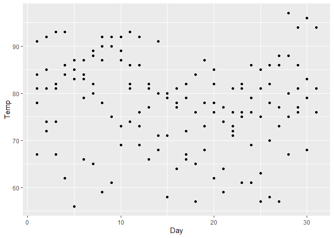

``` r
# 산점도 점 크기와 색상 변경하기
ggplot(airquality, aes(x = Day, y = Temp)) +
  geom_point(size = 3, color = 'red')
```

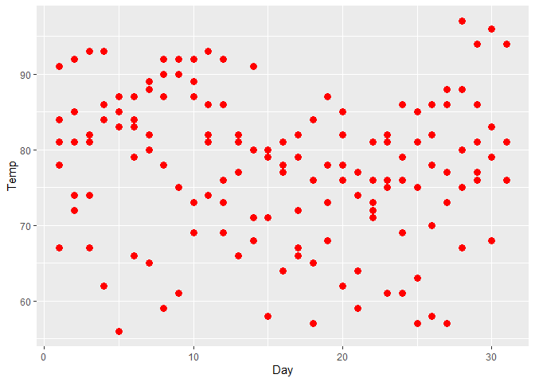

``` r
# 선 그래프 그리기
ggplot(airquality, aes(x = Day, y = Temp)) +
  geom_line()
```

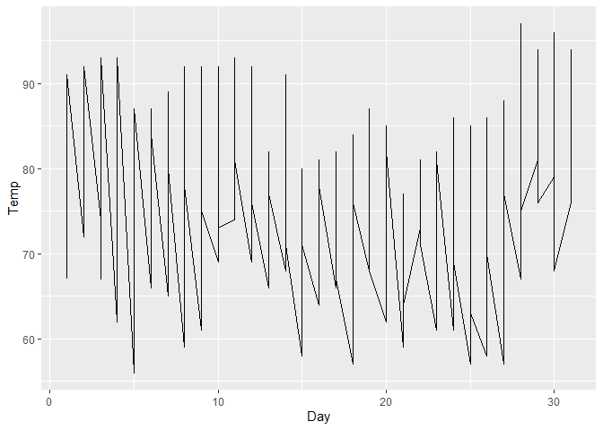

``` r
# 막대 그래프 그리기
ggplot(mtcars, aes(x = cyl)) +
  geom_bar(width = 0.5)
```

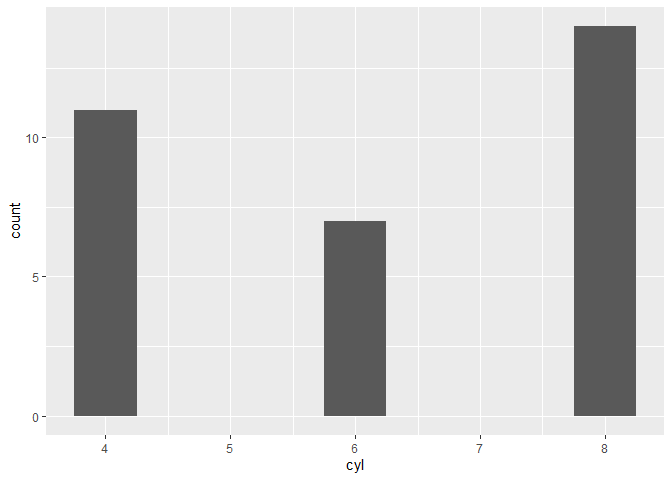

``` r
# 빈 범주를 제외한 막대 그래프 그리기
ggplot(mtcars, aes(x = factor(cyl))) +
  geom_bar(width = 0.5)
```

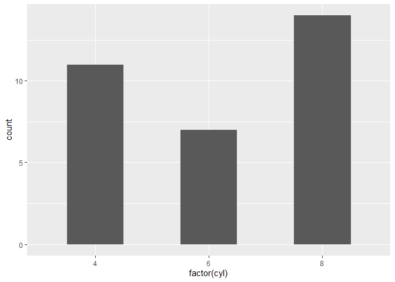

``` r
# 누적 막대 그래프 그리기
ggplot(mtcars, aes(x = factor(cyl))) +
  geom_bar(aes(fill = factor(gear)))
```

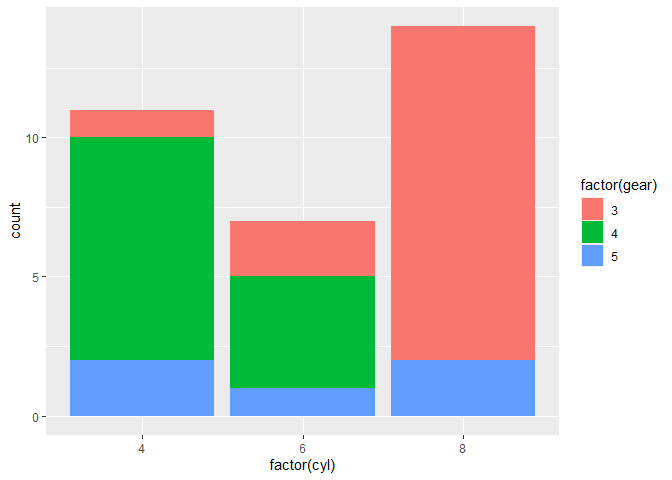

``` r
# 선버스트 차트 그리기
ggplot(mtcars, aes(x = factor(cyl))) +
  geom_bar(aes(fill = factor(gear))) +
  coord_polar()
```

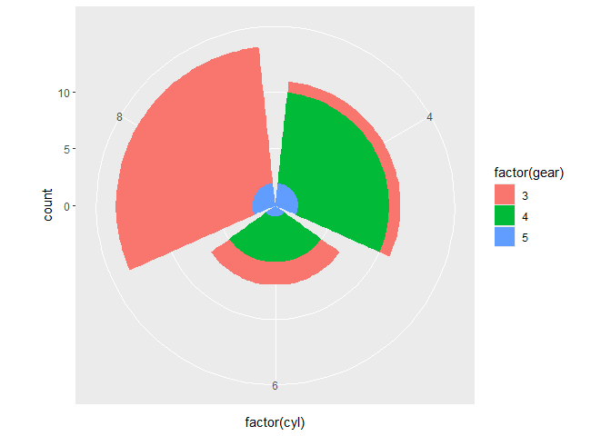

``` r
# 도넛 모양의 선버스트 차트 그리기
ggplot(mtcars, aes(x = factor(cyl))) +
  geom_bar(aes(fill = factor(gear))) +
  coord_polar(theta = "y")
```

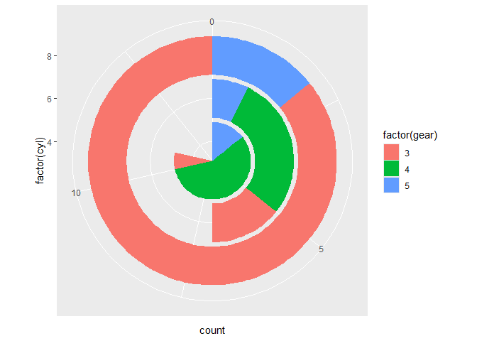

``` r
# 상자 그림 그리기
ggplot(airquality, aes(x = Day, y = Temp, group = Day)) +
  geom_boxplot()
```

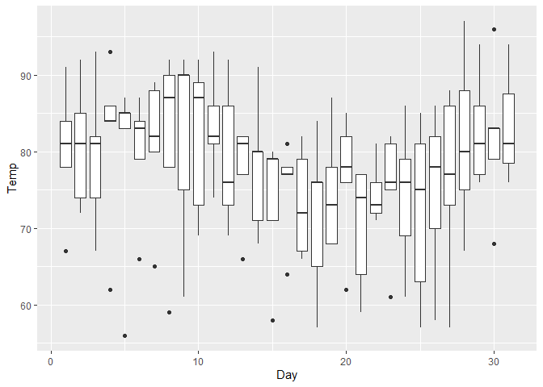

``` r
# 히스토그램 그리기
ggplot(airquality, aes(Temp)) +
  geom_histogram()
```

    `stat_bin()` using `bins = 30`. Pick better value `binwidth`.

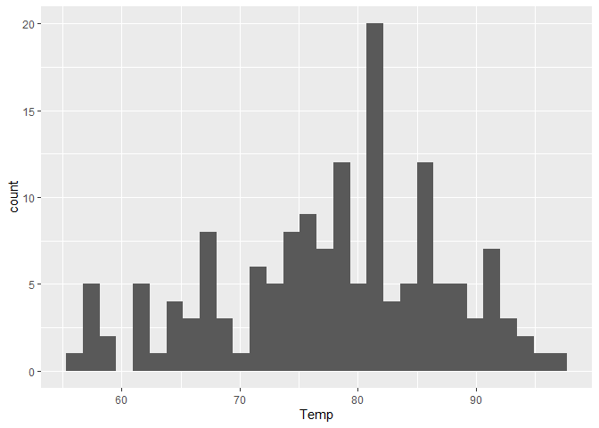

``` r
# 올바른 줄바꿈
ggplot(airquality, aes(x = Day, y = Temp)) +
  geom_point()
```


``` r
# 잘못된 줄바꿈
ggplot(airquality, aes(x = Day, y = Temp))
```

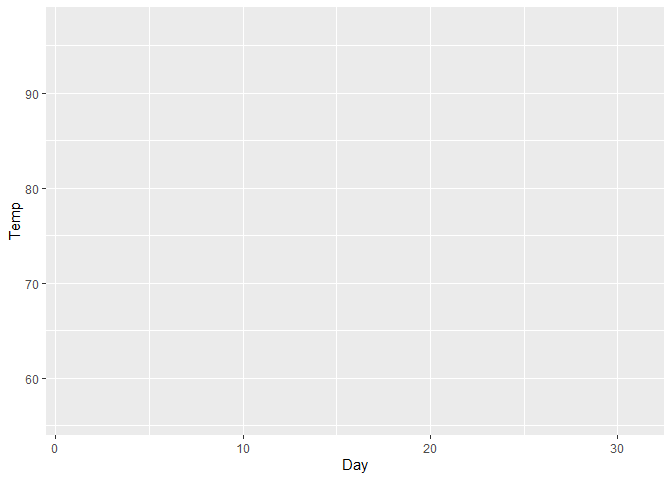

``` r
+ geom_point()
```

    Error:
    ! Cannot use `+` with a single argument.
    ℹ Did you accidentally put `+` on a new line?

``` r
# 선 그래프와 산점도 함께 그리기
ggplot(airquality, aes(x = Day, y = Temp)) +
  geom_line() +
  geom_point()
```

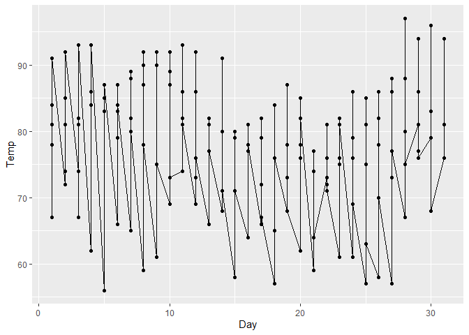

``` r
# 선 그래프 컬러와 산점도 점 크기 변경하기
ggplot(airquality, aes(x = Day, y = Temp)) +
  geom_line(color = "red") +
  geom_point(size = 3)
```

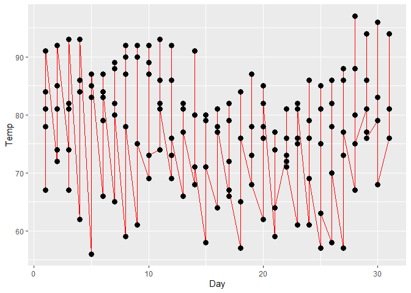

## 06-2 그래프에 객체 추가하기

geom_abline() : 사선, 선형회귀선으로 활용

geom_hline() : 평행선, 평균 등 표시에 활용

geom_vline() : 수직선, 특정 위치 나타낼 때 활용

as.Date() : 날짜 형식으로 변환

geom_text() : 레이블 입력

aanotate() : 도형 및 화살표

labs() : 그래프 제목 및 축 제목 추가

theme() : 디자인 테마 적용

``` r
# ggplot2 패키지 로드 및 economics 데이터 세트 구조 확인하기
library(ggplot2)
str(economics)
```

    spc_tbl_ [574 × 6] (S3: spec_tbl_df/tbl_df/tbl/data.frame)
     $ date    : Date[1:574], format: "1967-07-01" "1967-08-01" ...
     $ pce     : num [1:574] 507 510 516 512 517 ...
     $ pop     : num [1:574] 198712 198911 199113 199311 199498 ...
     $ psavert : num [1:574] 12.6 12.6 11.9 12.9 12.8 11.8 11.7 12.3 11.7 12.3 ...
     $ uempmed : num [1:574] 4.5 4.7 4.6 4.9 4.7 4.8 5.1 4.5 4.1 4.6 ...
     $ unemploy: num [1:574] 2944 2945 2958 3143 3066 ...

``` r
# 그래프에 사선 그리기
ggplot(economics, aes(x = date, y = psavert)) +
  geom_line() +
  geom_abline(intercept = 12.18671, slope = -0.0005444)
```

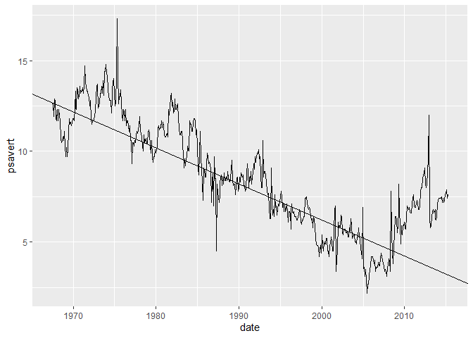

``` r
# 그래프에 평행선 그리기
ggplot(economics, aes(x = date, y = psavert)) +
  geom_line() +
  geom_hline(yintercept = mean(economics$psavert))
```


``` r
# 그래프에 수직선 그리기
library(dplyr)
```


    Attaching package: 'dplyr'

    The following objects are masked from 'package:stats':

        filter, lag

    The following objects are masked from 'package:base':

        intersect, setdiff, setequal, union

``` r
x_inter <- filter(economics, psavert == min(economics$psavert))$date

ggplot(economics, aes(x = date, y = psavert)) +
  geom_line() +
  geom_vline(xintercept = x_inter)
```


``` r
# 날짜 형식으로 직접 수직선 그리기
ggplot(economics, aes(x = date, y = psavert)) +
  geom_line() +
  geom_vline(xintercept = as.Date("2005-07-01"))
```

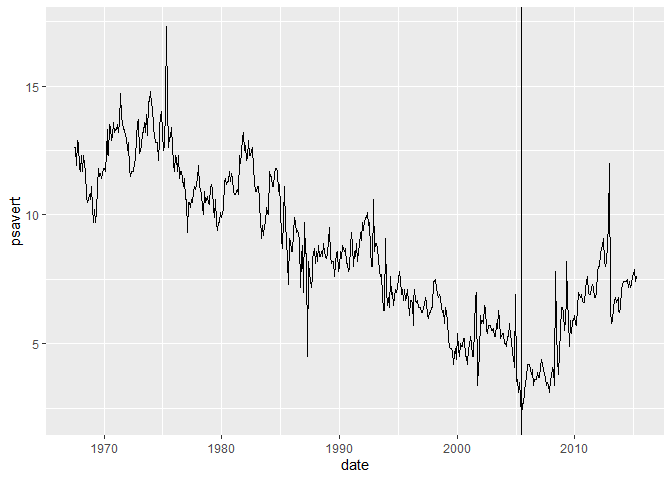

``` r
# 그래프에 텍스트 입력하기
ggplot(airquality, aes(x = Day, y = Temp)) +
  geom_point() +
  geom_text(aes(label = Temp, vjust = 0, hjust = 0))
```

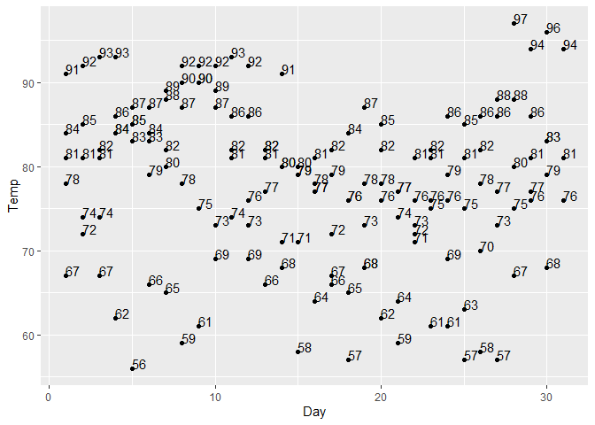

``` r
# 그래프에 사각형 그리기
ggplot(mtcars, aes(x = wt, y = mpg)) +
  geom_point() +
  annotate("rect", xmin = 3, xmax = 4, ymin = 12, ymax = 21,
           alpha = 0.5, fill = "skyblue")
```

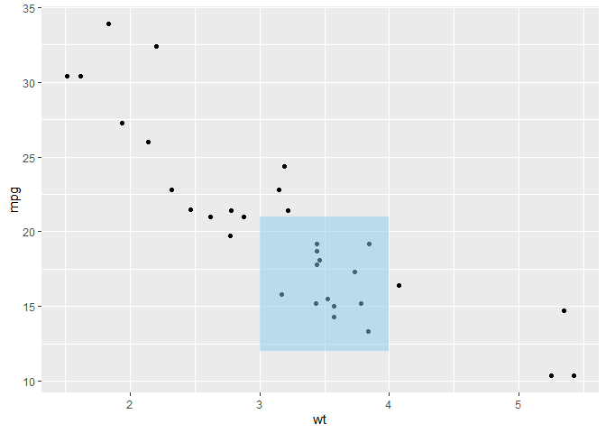

``` r
# 그래프에 화살표 그리기
ggplot(mtcars, aes(x = wt, y = mpg)) +
  geom_point() +
  annotate("rect", xmin = 3, xmax = 4, ymin = 12, ymax = 21,
           alpha = 0.5, fill = "skyblue") +
  annotate("segment", x = 2.5, xend = 3.7, y = 10, yend = 17,
           color = "red", arrow = arrow())
```


``` r
# 그래프와 축 젬고 추가하기
ggplot(mtcars, aes(x = gear)) +
  geom_bar() +
  labs(x = "기어 수", y = "자동차 수", title = "변속기 기어별 자동차 수")
```

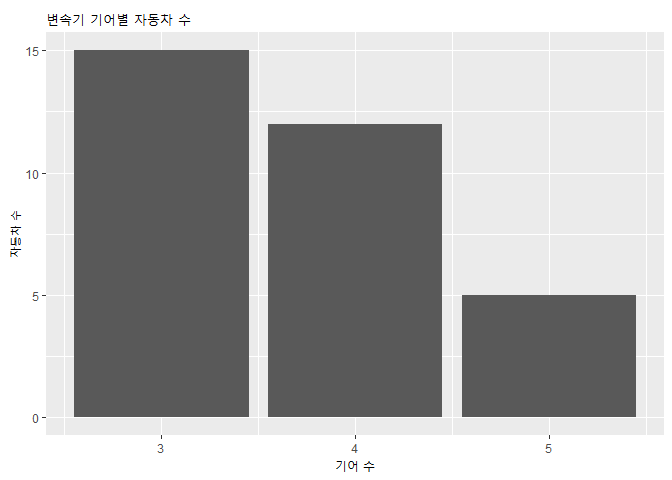

``` r
# 디자인 테마 적용하기
ggplot(mtcars, aes(x = gear)) + geom_bar() + theme_gray()
```


``` r
ggplot(mtcars, aes(x = gear)) + geom_bar() + theme_bw()
```


``` r
ggplot(mtcars, aes(x = gear)) + geom_bar() + theme_linedraw()
```

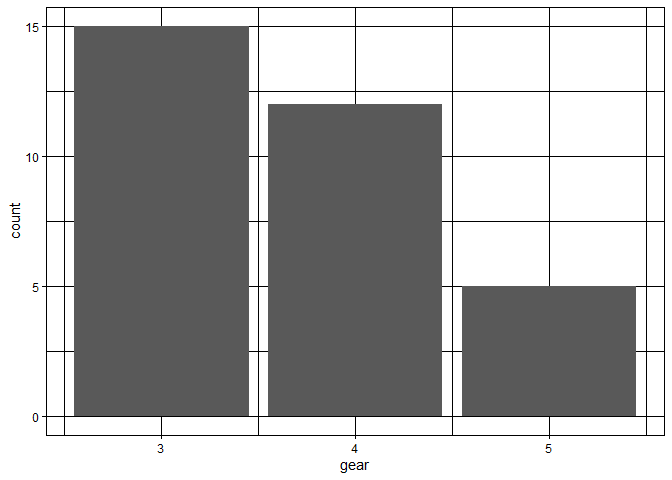

``` r
ggplot(mtcars, aes(x = gear)) + geom_bar() + theme_light()
```


``` r
ggplot(mtcars, aes(x = gear)) + geom_bar() + theme_dark()
```

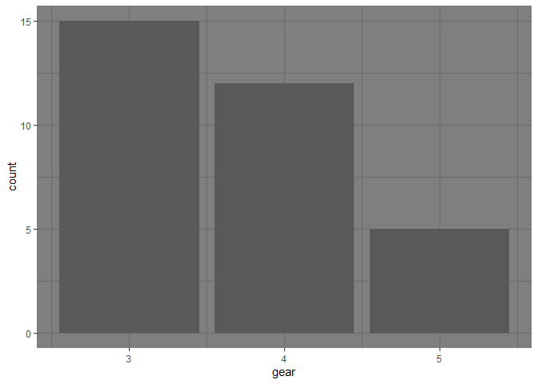

``` r
ggplot(mtcars, aes(x = gear)) + geom_bar() + theme_minimal()
```


``` r
ggplot(mtcars, aes(x = gear)) + geom_bar() + theme_classic()
```


``` r
ggplot(mtcars, aes(x = gear)) + geom_bar() + theme_void()
```


cor.test() : 상관분석

lm() : 회귀분석

``` r
# 엑셀 파일 가져오기
library(readxl)
exdata1 <- read_excel("../data/Sample1.xlsx")
exdata1
```

    # A tibble: 20 × 13
          ID SEX     AGE AREA  CAR_YN Y21_AMT Y21_CNT Y21F_AMT Y21O_CNT Y20_AMT
       <dbl> <chr> <dbl> <chr>  <dbl>   <dbl>   <dbl>    <dbl>    <dbl>   <dbl>
     1     1 F        50 서울       1 1300000      50   170000       25 1000000
     2     2 M        40 경기       1  450000      25    50000       10  700000
     3     3 F        28 제주       0  275000      10     7500        3  500000
     4     4 M        50 서울       0 2300000       8    50000        3 2500000
     5     5 M        27 서울       1  845000      30   130000       11  760000
     6     6 F        23 서울       0   42900       1        0        1  300000
     7     7 F        56 경기       0  150000       2     5000        1  130000
     8     8 F        47 서울       1  650000      10    45000        6  400000
     9     9 M        20 서울       0  930000       4    50000        3  250000
    10    10 F        38 경기       0  520000      17    11000       10  550000
    11    11 M        35 서울       0  150000       5    10000        3  490000
    12    12 F        44 제주       1 1150000      53   270000       37 1150000
    13    13 F        60 경기       0  550000      35   120000       10  800000
    14    14 M        55 제주       1 1050000      15   300000        5 2900000
    15    15 F        46 경기       1  600000      16   105000        4 1000000
    16    16 F        32 서울       1  530000      15   380000        7 1000000
    17    17 M        30 경기       1  250000       8    70000        6  400000
    18    18 F        29 서울       1  150000       5     7000        3  100000
    19    19 F        27 제주       0  300000      15   150000       10  320000
    20    20 M        27 제주       1  130000       4    38000        2  150000
    # ℹ 3 more variables: Y20_CNT <dbl>, Y20F_AMT <dbl>, Y20O_CNT <dbl>

``` r
# 상관분석하여 두 변수 간의 상관관계 확인하기
cor.test(exdata1$Y20_CNT, exdata1$Y21_CNT)
```


        Pearson's product-moment correlation

    data:  exdata1$Y20_CNT and exdata1$Y21_CNT
    t = 4.9343, df = 18, p-value = 0.000107
    alternative hypothesis: true correlation is not equal to 0
    95 percent confidence interval:
     0.4751688 0.8990895
    sample estimates:
          cor 
    0.7582507 

``` r
# 회귀분석하여 절편과 기울기 구하기
reg_result <- lm(Y21_CNT ~ Y20_CNT, data = exdata1)
reg_result
```


    Call:
    lm(formula = Y21_CNT ~ Y20_CNT, data = exdata1)

    Coefficients:
    (Intercept)      Y20_CNT  
         0.7104       0.7864  

## 06-3 지도 시각화 : ggmap 패키지

register_google(key = “API 키”)로 구글맵 API 키 등록

get_googlemap(center, maptype = “지도 유형”) : 설정한 위치를 지도로
가져옴

-center: 위도, 경도 값이나 위치를 포함하는 문자열 입력

-지도유형: terrain(기본), satellite(인공위성), roadmap(로드맵),
hybrid(인공위성+로드맵)

ggmap() : 위치 데이터를 지도로 시각화

geocode() : 위치를 포함하는 문자열을 위도와 경도 값으로 반환

``` r
# ggmap 패키지 설치 및 로드하기
# install.packages("ggmap")
library(ggmap)
```

    ℹ Google's Terms of Service: <https://mapsplatform.google.com>
      Stadia Maps' Terms of Service: <https://stadiamaps.com/terms-of-service>
      OpenStreetMap's Tile Usage Policy: <https://operations.osmfoundation.org/policies/tiles>
    ℹ Please cite ggmap if you use it! Use `citation("ggmap")` for details.

``` r
# 구글 지도에서 서울시 지도 가져오기기
my_key <- Sys.getenv("GOOGLE_MAPS_KEY")
register_google(key = my_key)

gg_seoul <- get_googlemap("seoul", maptype = "roadmap")
```

    ℹ <https://maps.googleapis.com/maps/api/staticmap?center=seoul&zoom=10&size=640x640&scale=2&maptype=roadmap&key=xxx-DQXWQtcsYRi_sYs>

    ℹ <https://maps.googleapis.com/maps/api/geocode/json?address=seoul&key=xxx-DQXWQtcsYRi_sYs>

``` r
ggmap(gg_seoul)
```

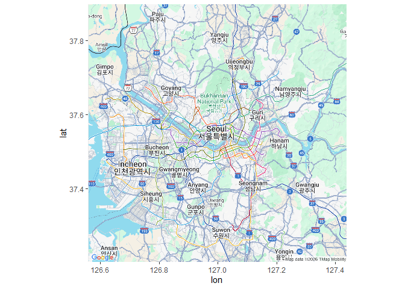

``` r
# 지도에 대전역 좌표를 점으로 표시하기
library(dplyr)
library(ggplot2)

geo_code <- enc2utf8("대전역") %>% geocode()
```

    ℹ <https://maps.googleapis.com/maps/api/geocode/json?address=%EB%8C%80%EC%A0%84%EC%97%AD&key=xxx-DQXWQtcsYRi_sYs>

    Warning: "대전역" not uniquely geocoded, using "daejeon station, 지하 218 jungang-ro,
    dong-gu, 대전광역시 south korea"

``` r
geo_data <- as.numeric(geo_code)

get_googlemap(center = geo_data, maptype = "roadmap", zoom = 13) %>%  ggmap() +
  geom_point(data = geo_code, aes(x = lon, y = lat))
```

    ℹ <https://maps.googleapis.com/maps/api/staticmap?center=36.331519,127.433637&zoom=13&size=640x640&scale=2&maptype=roadmap&key=xxx-DQXWQtcsYRi_sYs>

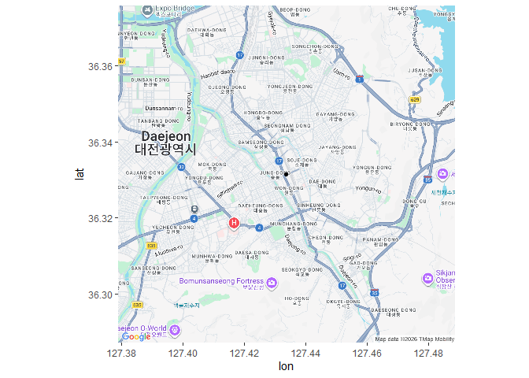

``` r
# 줌 옵션 조절하기
get_googlemap(center = geo_data, maptype = "roadmap", zoom = 9) %>% ggmap() +
  geom_point(data = geo_code, aes(x = lon, y = lat))
```

    ℹ <https://maps.googleapis.com/maps/api/staticmap?center=36.331519,127.433637&zoom=9&size=640x640&scale=2&maptype=roadmap&key=xxx-DQXWQtcsYRi_sYs>

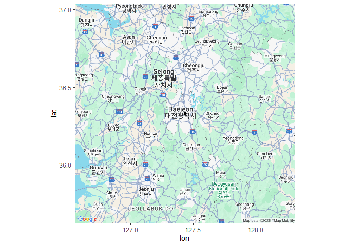

``` r
get_googlemap(center = geo_data, maptype = "roadmap", zoom = 17) %>% ggmap() +
  geom_point(data = geo_code, aes(x = lon, y = lat))
```

    ℹ <https://maps.googleapis.com/maps/api/staticmap?center=36.331519,127.433637&zoom=17&size=640x640&scale=2&maptype=roadmap&key=xxx-DQXWQtcsYRi_sYs>

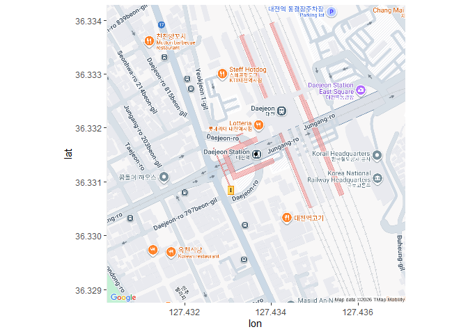
