# R_study_Ch07


# Ch07. 프로젝트로 실력 다지기

## 07-1 지역별 국내 휴양림 분포 비교하기

``` r
# 엑셀 파일 가져오기
library(readxl)

forest_example_data <- read_excel("../data/forest_example_data.xls")
colnames(forest_example_data) <- c("name", "city", "gubun", "area", "number",
                                   "stay", "city_new", "code", "codename")
str(forest_example_data)
```

    tibble [201 × 9] (S3: tbl_df/tbl/data.frame)
     $ name    : chr [1:201] "강씨봉자연휴양림" "칼봉산자연휴양림" "구름산산림욕장" "문수산산림욕장" ...
     $ city    : chr [1:201] "경기도" "경기도" "경기도" "경기도" ...
     $ gubun   : chr [1:201] "공유림" "공유림" "국유림" "공유림" ...
     $ area    : num [1:201] 9800000 2640000 3000000 700000 7790000 ...
     $ number  : num [1:201] 102 160 300 NA 172 1000 214 300 500 300 ...
     $ stay    : chr [1:201] "Y" "Y" "N" "N" ...
     $ city_new: chr [1:201] "경기도" "경기도" "경기도" "경기도" ...
     $ code    : chr [1:201] "6410000" "6410000" "6410000" "6410000" ...
     $ codename: chr [1:201] "경기도" "경기도" "경기도" "경기도" ...

``` r
head(forest_example_data)
```

    # A tibble: 6 × 9
      name             city   gubun     area number stay  city_new code    codename
      <chr>            <chr>  <chr>    <dbl>  <dbl> <chr> <chr>    <chr>   <chr>   
    1 강씨봉자연휴양림 경기도 공유림 9800000    102 Y     경기도   6410000 경기도  
    2 칼봉산자연휴양림 경기도 공유림 2640000    160 Y     경기도   6410000 경기도  
    3 구름산산림욕장   경기도 국유림 3000000    300 N     경기도   6410000 경기도  
    4 문수산산림욕장   경기도 공유림  700000     NA N     경기도   6410000 경기도  
    5 축령산자연휴양림 경기도 공유림 7790000    172 Y     경기도   6410000 경기도  
    6 동두천자연휴양림 경기도 공유림  700000   1000 Y     경기도   6410000 경기도  

``` r
# freq() 함수로 시도별 휴양림 빈도분석하기
library(descr)
freq(forest_example_data$city, plot = T, main = "city")
```

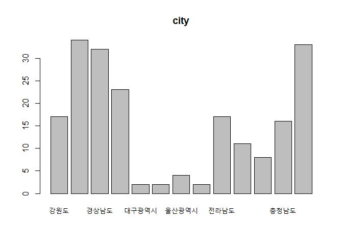

    forest_example_data$city 
                   Frequency Percent
    강원도                17   8.458
    경기도                34  16.915
    경상남도              32  15.920
    경상북도              23  11.443
    대구광역시             2   0.995
    대전광역시             2   0.995
    울산광역시             4   1.990
    인천광역시             2   0.995
    전라남도              17   8.458
    전라북도              11   5.473
    제주특별자치도         8   3.980
    충청남도              16   7.960
    충청북도              33  16.418
    Total                201 100.000

``` r
# table() 함수로 시도별 휴양림 빈도분석하기
city_table <- table(forest_example_data$city)
city_table
```


            강원도         경기도       경상남도       경상북도     대구광역시 
                17             34             32             23              2 
        대전광역시     울산광역시     인천광역시       전라남도       전라북도 
                 2              4              2             17             11 
    제주특별자치도       충청남도       충청북도 
                 8             16             33 

``` r
barplot(city_table)
```

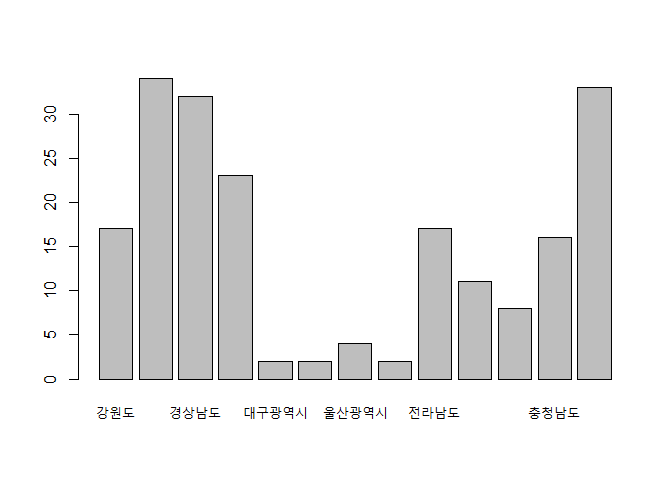

``` r
# count() 함수로 시도별 휴양림 빈도분석하고 내림차순 정렬하기
library(dplyr)
```


    Attaching package: 'dplyr'

    The following objects are masked from 'package:stats':

        filter, lag

    The following objects are masked from 'package:base':

        intersect, setdiff, setequal, union

``` r
count(forest_example_data, city) %>% arrange(desc(n))
```

    # A tibble: 13 × 2
       city               n
       <chr>          <int>
     1 경기도            34
     2 충청북도          33
     3 경상남도          32
     4 경상북도          23
     5 강원도            17
     6 전라남도          17
     7 충청남도          16
     8 전라북도          11
     9 제주특별자치도     8
    10 울산광역시         4
    11 대구광역시         2
    12 대전광역시         2
    13 인천광역시         2

``` r
# 소재지_시도명 컬럼으로 시도별 분포 확인하기
count(forest_example_data, city_new) %>% arrange(desc(n))
```

    # A tibble: 15 × 2
       city_new           n
       <chr>          <int>
     1 경기도            34
     2 충청북도          33
     3 경상남도          31
     4 경상북도          23
     5 강원도            17
     6 전라남도          17
     7 충청남도          15
     8 전라북도          11
     9 제주특별자치도     8
    10 울산광역시         4
    11 대구광역시         2
    12 대전광역시         2
    13 인천광역시         2
    14 경상남도하동군     1
    15 세종특별자치시     1

``` r
# 제공기관명 칼럼으로 시도별 분포 확인하기
count(forest_example_data, codename) %>% arrange(desc(n))
```

    # A tibble: 118 × 2
       codename            n
       <chr>           <int>
     1 충청북도           18
     2 경기도             17
     3 경상남도           16
     4 강원도 횡성군       4
     5 제주특별자치도      4
     6 충청남도 금산군     4
     7 경기도 양평군       3
     8 경상남도 함양군     3
     9 충청북도 충주시     3
    10 경기도 양주시       2
    # ℹ 108 more rows

## 07-2 해외 입국자 추이 확인하기

``` r
# 엑셀 파일 가져오기
library(readxl)
entrance_xls <- read_excel("../data/entrance_exam.xls")

str(entrance_xls)
```

    tibble [67 × 13] (S3: tbl_df/tbl/data.frame)
     $ 국적별    : chr [1:67] "일  본" "중  국" "대  만" "필리핀" ...
     $ 2020년01월: num [1:67] 203969 481681 110354 30702 66962 ...
     $ 2020년02월: num [1:67] 211199 104086 53042 20332 20966 ...
     $ 2020년03월: num [1:67] 8347 16595 585 4539 262 ...
     $ 2020년04월: num [1:67] 360 3935 155 1130 35 ...
     $ 2020년05월: num [1:67] 413 5124 189 1539 24 ...
     $ 2020년06월: num [1:67] 498 5051 240 2982 62 ...
     $ 2020년07월: num [1:67] 755 9738 305 10166 78 ...
     $ 2020년08월: num [1:67] 1275 16275 655 7362 167 ...
     $ 2020년09월: num [1:67] 794 15307 329 8485 115 ...
     $ 2020년10월: num [1:67] 927 11477 299 9041 59 ...
     $ 2020년11월: num [1:67] 1254 9174 299 9700 89 ...
     $ 2020년12월: num [1:67] 951 7987 264 9718 59 ...

``` r
head(entrance_xls)
```

    # A tibble: 6 × 13
      국적별 `2020년01월` `2020년02월` `2020년03월` `2020년04월` `2020년05월`
      <chr>         <dbl>        <dbl>        <dbl>        <dbl>        <dbl>
    1 일  본       203969       211199         8347          360          413
    2 중  국       481681       104086        16595         3935         5124
    3 대  만       110354        53042          585          155          189
    4 필리핀        30702        20332         4539         1130         1539
    5 홍  콩        66962        20966          262           35           24
    6 태  국        38466        31777         2371          299          195
    # ℹ 7 more variables: `2020년06월` <dbl>, `2020년07월` <dbl>,
    #   `2020년08월` <dbl>, `2020년09월` <dbl>, `2020년10월` <dbl>,
    #   `2020년11월` <dbl>, `2020년12월` <dbl>

``` r
# 컬럼명 변경과 띄어쓰기 제거하기
colnames(entrance_xls) <- c("country", "JAN", "FEB", "MAR", "APR", "MAY",
                            "JUN", "JUL", "AUG", "SEP", "OCT", "NOV", "DEC")
entrance_xls$country <- gsub(" ", "", entrance_xls$country)
entrance_xls
```

    # A tibble: 67 × 13
       country      JAN    FEB   MAR   APR   MAY   JUN   JUL   AUG   SEP   OCT   NOV
       <chr>      <dbl>  <dbl> <dbl> <dbl> <dbl> <dbl> <dbl> <dbl> <dbl> <dbl> <dbl>
     1 일본      203969 211199  8347   360   413   498   755  1275   794   927  1254
     2 중국      481681 104086 16595  3935  5124  5051  9738 16275 15307 11477  9174
     3 대만      110354  53042   585   155   189   240   305   655   329   299   299
     4 필리핀     30702  20332  4539  1130  1539  2982 10166  7362  8485  9041  9700
     5 홍콩       66962  20966   262    35    24    62    78   167   115    59    89
     6 태국       38466  31777  2371   299   195   313   609   781   523   460   391
     7 말레이시아……  27549  18541   890   152    90   121   136   276   186   180   168
     8 싱가포르   10738   5909   219    48    49    50    44   124    97   134   216
     9 인도네시아……  19443  15800  3760  1864  1752  2085  4089  2830  3396  3230  3723
    10 인도        9249   5839  1587   210   415  1799  3694  2060  2408  2348  1938
    # ℹ 57 more rows
    # ℹ 1 more variable: DEC <dbl>

문자열 대체 : gsub(“찾을 문자열”, “대체할 문자열”, 데이터)

``` r
# 1월 기준 상위 5개국 추출하기
entrance_xls |> nrow()
```

    [1] 67

``` r
top5_country <- entrance_xls[order(-entrance_xls$JAN),] |> head(n = 5)
top5_country
```

    # A tibble: 5 × 13
      country    JAN    FEB   MAR   APR   MAY   JUN   JUL   AUG   SEP   OCT   NOV
      <chr>    <dbl>  <dbl> <dbl> <dbl> <dbl> <dbl> <dbl> <dbl> <dbl> <dbl> <dbl>
    1 중국    481681 104086 16595  3935  5124  5051  9738 16275 15307 11477  9174
    2 일본    203969 211199  8347   360   413   498   755  1275   794   927  1254
    3 대만    110354  53042   585   155   189   240   305   655   329   299   299
    4 미국     67255  42439 10570  6417  8735  9717 11922 13368 12426 12366 13100
    5 홍콩     66962  20966   262    35    24    62    78   167   115    59    89
    # ℹ 1 more variable: DEC <dbl>

order() : 오름차순 정렬, 변수 앞의 - 기호로 내림차순 정렬

\|\> : 패키지 없이 사용 가능한 네이티브 파이프 연산자

``` r
# 데이터 구조 재구조화하기
library(reshape2)
top5_melt <- melt(top5_country, id.vars = "country", variable.name = 'mon')
head(top5_melt)
```

      country mon  value
    1    중국 JAN 481681
    2    일본 JAN 203969
    3    대만 JAN 110354
    4    미국 JAN  67255
    5    홍콩 JAN  66962
    6    중국 FEB 104086

``` r
# 선 그래프 그리기
library(ggplot2)

ggplot(top5_melt, aes(x = mon, y = value, group = country)) +
  geom_line(aes(color = country))
```

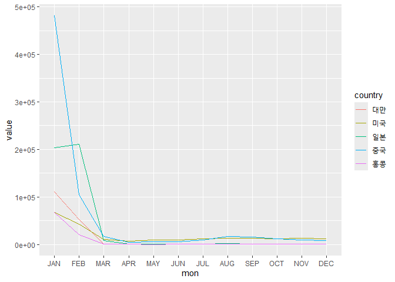

``` r
# 그래프 제목 지정하고 y축 범위 조정하기
ggplot(top5_melt, aes(x = mon, y = value, group = country)) +
  geom_line(aes(color = country)) +
  ggtitle("2020년 국적별 입국 수 변화 추이") +
  scale_y_continuous(breaks = seq(0, 500000, 50000))
```

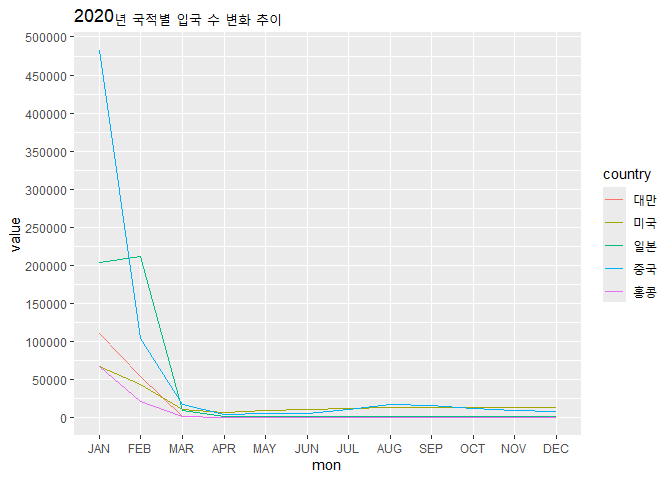

y축 범위 조정: scale_y_continuous() 함수 사용, seq()를 함께 사용해
일정한 간격 조정 가능

``` r
# 막대 그래프 그리기
ggplot(top5_melt, aes(x = mon, y = value, fill = country)) +
  geom_bar(stat = "identity", position = "dodge")
```

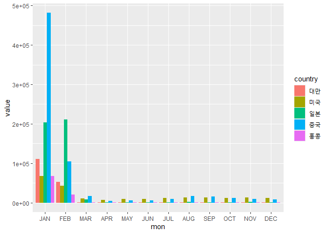

``` r
# 누적 막대 그래프 그리기
ggplot(top5_melt, aes(x = mon, y = value, fill = country)) +
  geom_bar(stat = "identity", position = "stack")
```

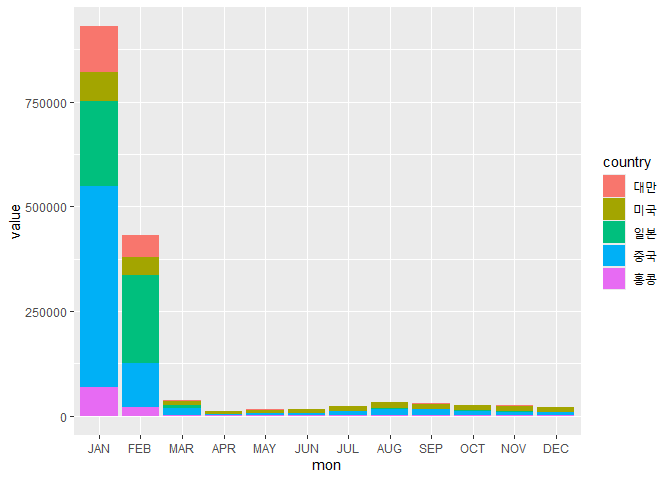

## 07-3 지도에서 코로나19 선별진료소 위치 확인하기

``` r
# 엑셀 파일 가져오기
library(readxl)

xlsdata <- read_excel("../data/선별진료소_20211125194459.xls")
View(xlsdata)
```

``` r
# 데이터 컬럼 추출 및 열 이름 변경하기
data_raw <- xlsdata[, c(2:5)]
head(data_raw)
```

    # A tibble: 6 × 4
      시도  시군구 의료기관명       주소                                      
      <chr> <chr>  <chr>            <chr>                                     
    1 서울  강남구 강남구보건소     서울 강남구 삼성동(삼성2동) 8 강남구보건소
    2 서울  강남구 삼성서울병원     서울 강남구 일원로81 삼성서울병원         
    3 서울  강남구 강남세브란스병원 서울 강남구 언주로211 강남세브란스병원    
    4 서울  강동구 강동구보건소     서울 강동구 성내로45                      
    5 서울  강동구 중앙보훈병원     서울 강동구 진황도로 61길 53              
    6 서울  강동구 강동경희대병원   서울시 강동구 동남로 892                  

``` r
names(data_raw)
```

    [1] "시도"       "시군구"     "의료기관명" "주소"      

``` r
names(data_raw) <- c("state", "city", "name", "addr")
names(data_raw)
```

    [1] "state" "city"  "name"  "addr" 

``` r
# state 컬럼 빈도 확인하기
table(data_raw$state)
```


    강원 경기 경남 경북 광주 대구 대전 부산 서울 세종 울산 인천 전남 전북 제주 충남 
      39  113   56   51   12   21   14   46   71    2   13   32   57   27   13   33 
    충북 
      31 

``` r
barplot(table(data_raw$state))
```

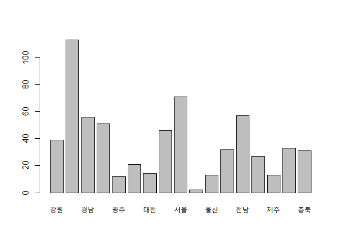

``` r
# 대전시 선별진료소 데이터 추출하기
daejeon_data <- data_raw[data_raw$state == "대전", ]
head(daejeon_data)
```

    # A tibble: 6 × 4
      state city   name                  addr                               
      <chr> <chr>  <chr>                 <chr>                              
    1 대전  대덕구 대덕구보건소          대전 대덕구 석봉로38번길55 (석봉동)
    2 대전  대덕구 근로복지공단 대전병원 대덕구 계족로 637                  
    3 대전  대덕구 대전보훈병원          대덕구 대청로 82번길 147           
    4 대전  동구   대전광역시 동구보건소 대전광역시 동구 가오동 425         
    5 대전  동구   대전한국병원          대전광역시 동구 동서대로 1672      
    6 대전  서구   대전광역시 서구보건소 대전 서구 만년동 340번지           

``` r
nrow(daejeon_data)
```

    [1] 14

``` r
# 데이터 세트에서 선별진료소 위도와 경도 데이터 가져오기
library(ggmap)
```

    ℹ Google's Terms of Service: <https://mapsplatform.google.com>
      Stadia Maps' Terms of Service: <https://stadiamaps.com/terms-of-service>
      OpenStreetMap's Tile Usage Policy: <https://operations.osmfoundation.org/policies/tiles>
    ℹ Please cite ggmap if you use it! Use `citation("ggmap")` for details.

``` r
my_key <- Sys.getenv("GOOGLE_MAPS_KEY")
register_google(my_key)

daejeon_data <- mutate_geocode(data = daejeon_data, location = addr, 
                               source = "google")
```

    ℹ <https://maps.googleapis.com/maps/api/geocode/json?address=%EB%8C%80%EC%A0%84+%EB%8C%80%EB%8D%95%EA%B5%AC+%EC%84%9D%EB%B4%89%EB%A1%9C38%EB%B2%88%EA%B8%B855+(%EC%84%9D%EB%B4%89%EB%8F%99)&key=xxx-DQXWQtcsYRi_sYs>
    ℹ <https://maps.googleapis.com/maps/api/geocode/json?address=%EB%8C%80%EB%8D%95%EA%B5%AC+%EA%B3%84%EC%A1%B1%EB%A1%9C+637&key=xxx-DQXWQtcsYRi_sYs>
    ℹ <https://maps.googleapis.com/maps/api/geocode/json?address=%EB%8C%80%EB%8D%95%EA%B5%AC+%EB%8C%80%EC%B2%AD%EB%A1%9C+82%EB%B2%88%EA%B8%B8+147&key=xxx-DQXWQtcsYRi_sYs>
    ℹ <https://maps.googleapis.com/maps/api/geocode/json?address=%EB%8C%80%EC%A0%84%EA%B4%91%EC%97%AD%EC%8B%9C+%EB%8F%99%EA%B5%AC+%EA%B0%80%EC%98%A4%EB%8F%99+425&key=xxx-DQXWQtcsYRi_sYs>
    ℹ <https://maps.googleapis.com/maps/api/geocode/json?address=%EB%8C%80%EC%A0%84%EA%B4%91%EC%97%AD%EC%8B%9C+%EB%8F%99%EA%B5%AC+%EB%8F%99%EC%84%9C%EB%8C%80%EB%A1%9C+1672&key=xxx-DQXWQtcsYRi_sYs>
    ℹ <https://maps.googleapis.com/maps/api/geocode/json?address=%EB%8C%80%EC%A0%84+%EC%84%9C%EA%B5%AC+%EB%A7%8C%EB%85%84%EB%8F%99+340%EB%B2%88%EC%A7%80&key=xxx-DQXWQtcsYRi_sYs>
    ℹ <https://maps.googleapis.com/maps/api/geocode/json?address=%EB%8C%80%EC%A0%84+%EC%84%9C%EA%B5%AC+%EB%91%94%EC%82%B0%EC%84%9C%EB%A1%9C+95&key=xxx-DQXWQtcsYRi_sYs>
    ℹ <https://maps.googleapis.com/maps/api/geocode/json?address=%EB%8C%80%EC%A0%84+%EC%84%9C%EA%B5%AC+%EA%B4%80%EC%A0%80%EB%8F%99%EB%A1%9C+158&key=xxx-DQXWQtcsYRi_sYs>
    ℹ <https://maps.googleapis.com/maps/api/geocode/json?address=%EB%8C%80%EC%A0%84+%EC%A4%91%EA%B5%AC+%EB%AC%B8%ED%99%942%EB%8F%99+785+%EC%A4%91%EA%B5%AC%EB%B3%B4%EA%B1%B4%EC%86%8C&key=xxx-DQXWQtcsYRi_sYs>

    Warning: "대전 중구 문화2동 785 중구보건소" not uniquely geocoded, using "south korea,
    대전광역시 중구 문화2동"

    ℹ <https://maps.googleapis.com/maps/api/geocode/json?address=%EB%8C%80%EC%A0%84%EA%B4%91%EC%97%AD%EC%8B%9C+%EC%A4%91%EA%B5%AC+%EB%8C%80%ED%9D%A5%EB%A1%9C+64+%EA%B0%80%ED%86%A8%EB%A6%AD%EB%8C%80%ED%95%99%EA%B5%90%EB%8C%80%EC%A0%84%EC%84%B1%EB%AA%A8%EB%B3%91%EC%9B%90&key=xxx-DQXWQtcsYRi_sYs>
    ℹ <https://maps.googleapis.com/maps/api/geocode/json?address=%EB%8C%80%EC%A0%84%EA%B4%91%EC%97%AD%EC%8B%9C+%EC%A4%91%EA%B5%AC+%EB%AA%A9%EC%A4%91%EB%A1%9C+29+%EB%8C%80%EC%A0%84%EC%84%A0%EB%B3%91%EC%9B%90&key=xxx-DQXWQtcsYRi_sYs>
    ℹ <https://maps.googleapis.com/maps/api/geocode/json?address=%EB%8C%80%EC%A0%84+%EC%A4%91%EA%B5%AC+%EB%AC%B8%ED%99%94%EB%A1%9C+282+%EC%B6%A9%EB%82%A8%EB%8C%80%ED%95%99%EA%B5%90%EB%B3%91%EC%9B%90&key=xxx-DQXWQtcsYRi_sYs>
    ℹ <https://maps.googleapis.com/maps/api/geocode/json?address=%EB%8C%80%EC%A0%84+%EC%9C%A0%EC%84%B1%EA%B5%AC+%EB%85%B8%EC%9D%80%EB%8F%99+270+%EC%9B%94%EB%93%9C%EC%BB%B5%EB%B3%B4%EC%A1%B0%EA%B2%BD%EA%B8%B0%EC%9E%A5+P2%EC%A3%BC%EC%B0%A8%EC%9E%A5&key=xxx-DQXWQtcsYRi_sYs>
    ℹ <https://maps.googleapis.com/maps/api/geocode/json?address=%EB%B6%81%EC%9C%A0%EC%84%B1%EB%8C%80%EB%A1%9C93&key=xxx-DQXWQtcsYRi_sYs>

``` r
head(daejeon_data)
```

    # A tibble: 6 × 6
      state city   name                  addr                              lon   lat
      <chr> <chr>  <chr>                 <chr>                           <dbl> <dbl>
    1 대전  대덕구 대덕구보건소          대전 대덕구 석봉로38번길55 (석봉동)……  127.  36.4
    2 대전  대덕구 근로복지공단 대전병원 대덕구 계족로 637                127.  36.4
    3 대전  대덕구 대전보훈병원          대덕구 대청로 82번길 147         127.  36.4
    4 대전  동구   대전광역시 동구보건소 대전광역시 동구 가오동 425       127.  36.3
    5 대전  동구   대전한국병원          대전광역시 동구 동서대로 1672    127.  36.3
    6 대전  서구   대전광역시 서구보건소 대전 서구 만년동 340번지         127.  36.4

``` r
head(daejeon_data$lon)
```

    [1] 127.4263 127.4285 127.4397 127.4548 127.4358 127.3810

mutate_geocode() : 데이터 프레임의 컬럼명으로 주소가 있는 열을 기준으로
여러 주소의 경도와 위도 데이터를 한 번에 가져옴

``` r
# 대전시 지도 시각화하기
daejeon_map <- get_googlemap('대전', maptype = 'roadmap', zoom = 11)
```

    ℹ <https://maps.googleapis.com/maps/api/staticmap?center=%EB%8C%80%EC%A0%84&zoom=11&size=640x640&scale=2&maptype=roadmap&key=xxx-DQXWQtcsYRi_sYs>

    ℹ <https://maps.googleapis.com/maps/api/geocode/json?address=%EB%8C%80%EC%A0%84&key=xxx-DQXWQtcsYRi_sYs>

``` r
ggmap(daejeon_map) +
  geom_point(data = daejeon_data,
             aes(x = lon, y = lat, color = factor(name)), size = 3)
```

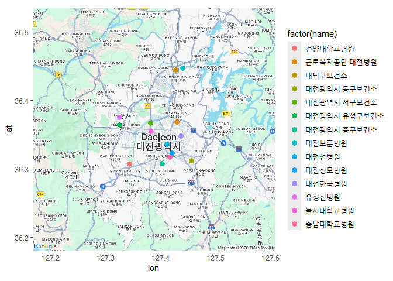

``` r
# 마커로 위치 표시하고 위치 이름 넣기
daejeon_data_marker <- data.frame(daejeon_data$lon, daejeon_data$lat)
daejeon_map <- get_googlemap('대전', maptype = 'roadmap', zoom = 11,
                             markers = daejeon_data_marker)
```

    ℹ <https://maps.googleapis.com/maps/api/staticmap?center=%EB%8C%80%EC%A0%84&zoom=11&size=640x640&scale=2&maptype=roadmap&markers=36.444898,127.426283|36.368576,127.4285|36.447137,127.439686|36.311876,127.454828|36.348317,127.435754|36.36709,127.380978|36.355067,127.381988|36.306927,127.343156|36.307763,127.401876|36.323225,127.420244|36.336092,127.410631|36.316771,127.416226|36.364563,127.324194|36.375126,127.3249&key=xxx-DQXWQtcsYRi_sYs>

    ℹ <https://maps.googleapis.com/maps/api/geocode/json?address=%EB%8C%80%EC%A0%84&key=xxx-DQXWQtcsYRi_sYs>

``` r
ggmap(daejeon_map) +
  geom_text(data = daejeon_data, aes(x = lon, y = lat), size = 3,
            label = daejeon_data$name)
```

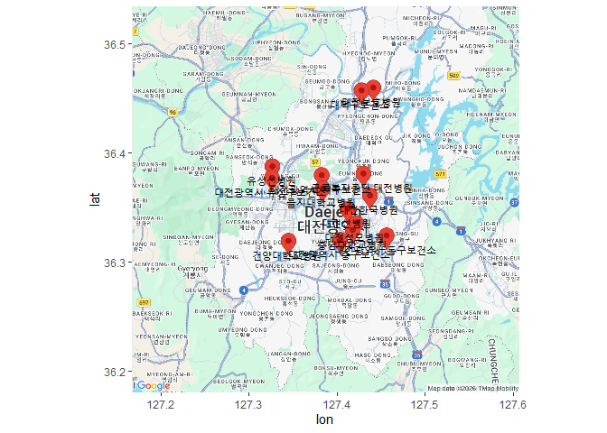

## 07-4 서울시 지역별 미세먼지 농도 차이 비교하기

``` r
# 엑셀 파일 가져오기
library(readxl)
dustdata <- read_excel("../data/dustdata.xlsx")

View(dustdata)
str(dustdata)
```

    tibble [31 × 27] (S3: tbl_df/tbl/data.frame)
     $ 날짜       : chr [1:31] "2021-01-01" "2021-01-02" "2021-01-03" "2021-01-04" ...
     $ 서울시 평균: num [1:31] 25 31 36 37 27 23 33 19 24 31 ...
     $ 강남구     : num [1:31] 22 27 30 33 22 20 31 16 21 27 ...
     $ 강동구     : num [1:31] 30 36 42 45 29 29 34 23 29 35 ...
     $ 강북구     : num [1:31] 33 40 45 44 30 28 32 25 33 41 ...
     $ 강서구     : num [1:31] 25 22 38 42 26 26 29 20 25 32 ...
     $ 관악구     : num [1:31] 21 27 31 27 26 18 25 16 20 25 ...
     $ 광진구     : num [1:31] 25 29 35 34 23 23 29 17 24 31 ...
     $ 구로구     : num [1:31] 24 33 37 39 30 NA 26 16 21 31 ...
     $ 금천구     : num [1:31] 28 34 41 35 29 24 30 21 26 34 ...
     $ 노원구     : num [1:31] 29 35 40 40 32 27 35 22 30 35 ...
     $ 도봉구     : num [1:31] 22 29 30 33 20 9 25 13 20 26 ...
     $ 동대문구   : num [1:31] 23 27 30 33 27 20 31 16 21 29 ...
     $ 동작구     : num [1:31] 26 35 39 36 29 26 32 23 28 35 ...
     $ 마포구     : num [1:31] 22 27 31 32 22 20 33 19 22 28 ...
     $ 서대문구   : num [1:31] 25 26 36 28 19 17 30 13 NA 26 ...
     $ 서초구     : num [1:31] 22 32 30 35 32 26 30 18 23 30 ...
     $ 성동구     : num [1:31] 22 27 30 34 23 21 33 17 22 28 ...
     $ 성북구     : num [1:31] 24 28 31 35 36 17 41 12 21 27 ...
     $ 송파구     : num [1:31] 21 30 34 37 22 22 33 NA 21 26 ...
     $ 양천구     : num [1:31] 27 22 38 41 29 26 30 22 27 34 ...
     $ 영등포구   : num [1:31] 23 26 30 32 25 20 23 17 21 27 ...
     $ 용산구     : num [1:31] 32 44 46 47 33 33 46 30 34 43 ...
     $ 은평구     : num [1:31] 22 32 31 31 32 21 43 17 21 25 ...
     $ 종로구     : num [1:31] 30 36 38 41 38 26 49 20 26 35 ...
     $ 중구       : num [1:31] 30 36 41 44 28 29 38 23 27 40 ...
     $ 중랑구     : num [1:31] 26 31 36 37 25 23 28 18 24 31 ...

``` r
# 성북구와 중구 데이터만 추출하기
library(dplyr)
dustdata_anal <- dustdata[, c("날짜", "성북구", "중구")]
View(dustdata_anal)
```

``` r
# 결측치 확인하기
is.na(dustdata_anal)
```

           날짜 성북구  중구
     [1,] FALSE  FALSE FALSE
     [2,] FALSE  FALSE FALSE
     [3,] FALSE  FALSE FALSE
     [4,] FALSE  FALSE FALSE
     [5,] FALSE  FALSE FALSE
     [6,] FALSE  FALSE FALSE
     [7,] FALSE  FALSE FALSE
     [8,] FALSE  FALSE FALSE
     [9,] FALSE  FALSE FALSE
    [10,] FALSE  FALSE FALSE
    [11,] FALSE  FALSE FALSE
    [12,] FALSE  FALSE FALSE
    [13,] FALSE  FALSE FALSE
    [14,] FALSE  FALSE FALSE
    [15,] FALSE  FALSE FALSE
    [16,] FALSE  FALSE FALSE
    [17,] FALSE  FALSE FALSE
    [18,] FALSE  FALSE FALSE
    [19,] FALSE  FALSE FALSE
    [20,] FALSE  FALSE FALSE
    [21,] FALSE  FALSE FALSE
    [22,] FALSE  FALSE FALSE
    [23,] FALSE  FALSE FALSE
    [24,] FALSE  FALSE FALSE
    [25,] FALSE  FALSE FALSE
    [26,] FALSE  FALSE FALSE
    [27,] FALSE  FALSE FALSE
    [28,] FALSE  FALSE FALSE
    [29,] FALSE  FALSE FALSE
    [30,] FALSE  FALSE FALSE
    [31,] FALSE  FALSE FALSE

``` r
sum(is.na(dustdata_anal))
```

    [1] 0

``` r
# 지역별 미세먼지 농도의 기술통계량 구하기
library(psych)
```


    Attaching package: 'psych'

    The following objects are masked from 'package:ggplot2':

        %+%, alpha

``` r
describe(dustdata_anal$성북구)
```

       vars  n  mean    sd median trimmed   mad min max range skew kurtosis   se
    X1    1 31 36.97 20.98     35   34.64 17.79   5 111   106  1.4     2.89 3.77

``` r
describe(dustdata_anal$중구)
```

       vars  n  mean    sd median trimmed   mad min max range skew kurtosis   se
    X1    1 31 43.68 22.72     40   40.56 17.79  13 118   105 1.36     1.95 4.08

``` r
# 성북구와 중구 미세먼지 농도 상자 그림 그리기
boxplot(dustdata_anal$성북구, dustdata_anal$중구,
        main = "finedust_compare", xlab = "AREA", names = c("성북구", "중구"),
        ylab = "FINEDUST_PM", col = c("blue", "green"))
```

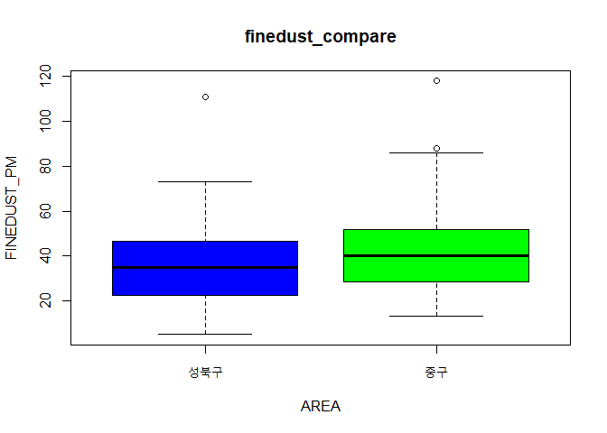

f검정 var.test()

``` r
# f검정으로 지역별 미세먼지 농도의 분산 차이를 검정하기
var.test(dustdata_anal$중구, dustdata_anal$성북구)
```


        F test to compare two variances

    data:  dustdata_anal$중구 and dustdata_anal$성북구
    F = 1.1728, num df = 30, denom df = 30, p-value = 0.6653
    alternative hypothesis: true ratio of variances is not equal to 1
    95 percent confidence interval:
     0.5654796 2.4322651
    sample estimates:
    ratio of variances 
              1.172773 

t검정 t.test()

``` r
# t검정으로 지역별 미세먼지 농도의 평균 차이를 검정하기
t.test(dustdata_anal$중구, dustdata_anal$성북구, var.equal = T)
```


        Two Sample t-test

    data:  dustdata_anal$중구 and dustdata_anal$성북구
    t = 1.2079, df = 60, p-value = 0.2318
    alternative hypothesis: true difference in means is not equal to 0
    95 percent confidence interval:
     -4.401547 17.820902
    sample estimates:
    mean of x mean of y 
     43.67742  36.96774 

분산분석: anova(lm())

``` r
#엑셀 파일 가져오기 
library(readxl)
exdata1 <- read_excel("../data/Sample1.xlsx")
exdata1
```

    # A tibble: 20 × 13
          ID SEX     AGE AREA  CAR_YN Y21_AMT Y21_CNT Y21F_AMT Y21O_CNT Y20_AMT
       <dbl> <chr> <dbl> <chr>  <dbl>   <dbl>   <dbl>    <dbl>    <dbl>   <dbl>
     1     1 F        50 서울       1 1300000      50   170000       25 1000000
     2     2 M        40 경기       1  450000      25    50000       10  700000
     3     3 F        28 제주       0  275000      10     7500        3  500000
     4     4 M        50 서울       0 2300000       8    50000        3 2500000
     5     5 M        27 서울       1  845000      30   130000       11  760000
     6     6 F        23 서울       0   42900       1        0        1  300000
     7     7 F        56 경기       0  150000       2     5000        1  130000
     8     8 F        47 서울       1  650000      10    45000        6  400000
     9     9 M        20 서울       0  930000       4    50000        3  250000
    10    10 F        38 경기       0  520000      17    11000       10  550000
    11    11 M        35 서울       0  150000       5    10000        3  490000
    12    12 F        44 제주       1 1150000      53   270000       37 1150000
    13    13 F        60 경기       0  550000      35   120000       10  800000
    14    14 M        55 제주       1 1050000      15   300000        5 2900000
    15    15 F        46 경기       1  600000      16   105000        4 1000000
    16    16 F        32 서울       1  530000      15   380000        7 1000000
    17    17 M        30 경기       1  250000       8    70000        6  400000
    18    18 F        29 서울       1  150000       5     7000        3  100000
    19    19 F        27 제주       0  300000      15   150000       10  320000
    20    20 M        27 제주       1  130000       4    38000        2  150000
    # ℹ 3 more variables: Y20_CNT <dbl>, Y20F_AMT <dbl>, Y20O_CNT <dbl>

``` r
# 경기, 서울, 제주 지역 Y20_CNT를 상자 그림으로 그리기
boxplot(formula = Y20_CNT ~ AREA, data = exdata1)
```

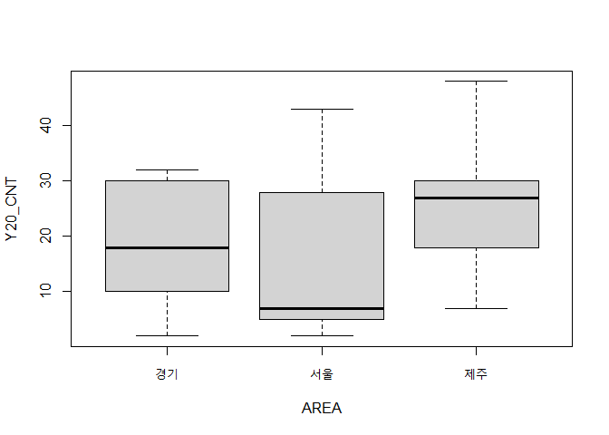

``` r
# 분산분석으로 세 집단 간 평균 차이 검정하기
anova(lm(Y20_CNT ~ AREA, data = exdata1))
```

    Analysis of Variance Table

    Response: Y20_CNT
              Df Sum Sq Mean Sq F value Pr(>F)
    AREA       2  245.6  122.81  0.5545 0.5844
    Residuals 17 3765.3  221.49               

일원분산분석: oneway.test()

``` r
# 분산분석으로 세 집단 간 평균 차이 검정하기
oneway.test(data = exdata1, Y20_CNT ~ AREA, var.equal = T)
```


        One-way analysis of means

    data:  Y20_CNT and AREA
    F = 0.55446, num df = 2, denom df = 17, p-value = 0.5844
